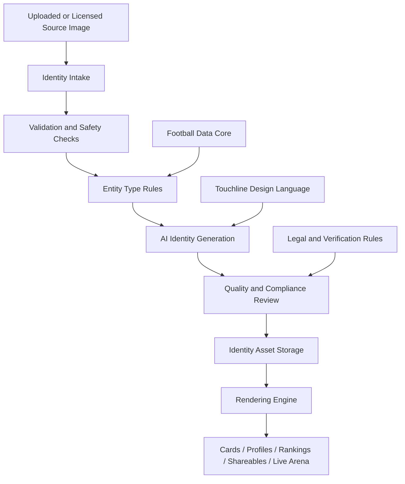
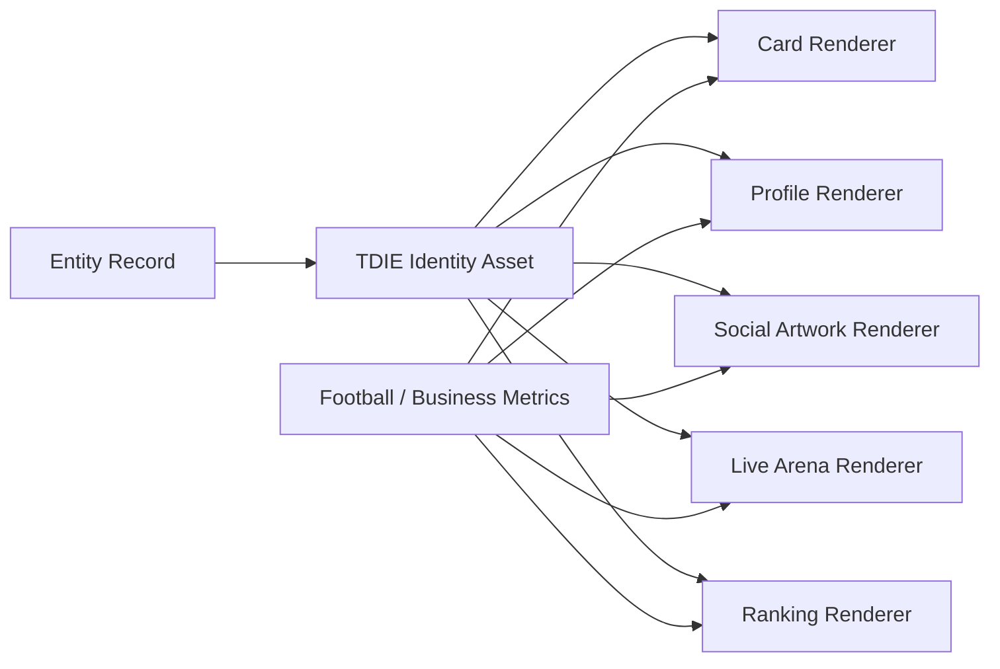

# Touchline Digital Identity Engine

Version: 1.0  
Author: Touchline Executive Product, Creative and Architecture Board  
Last Updated: 2026-06-26  
Status: Official Architecture Decision  
Dependencies: 00_Governance, 03_Fantasy, 07_Architecture, 08_Database, 09_UI_UX, 11_Roadmap  
Future Related Documents: Identity Engine API Contract, Identity Rendering Pipeline, AI Avatar Safety Rules, Card Visual System, Shareable Media System

## Executive Summary

The Touchline Digital Identity Engine, abbreviated as TDIE, is the single platform-wide system responsible for creating, managing and rendering every visual identity inside Touchline.

Touchline must never build isolated avatar systems for players, agents, coaches, club owners, clubs, scouts, academies or investors. Every identity must pass through one reusable engine.

Touchline is not only a database or a CRM. It is a football business universe. Every entity inside that universe must feel premium, consistent, recognizable and emotionally valuable.

The goal is simple:

> Every visual identity inside Touchline must be generated by one single engine.

This includes profile avatars, cards, identity animations, prestige borders, shareable artwork, rankings, competition visuals, Transfer Center cards, Live Arena cards and future identity formats.

## Core Principle

Every uploaded image must pass through the Touchline Digital Identity Engine.

No raw profile photo should appear directly in the final premium platform experience unless explicitly marked as an original source image in an admin/debug context.

The TDIE transforms uploaded or sourced identity material into a premium Touchline identity while preserving truthful identity signals:

- Real facial identity for people.
- Official crest identity for clubs.
- Brand identity for agencies, academies and investor organizations.
- Role-specific visual context.
- Touchline-wide design consistency.

The engine must never misrepresent identity, affiliation, licensing, club membership, nationality, contract status or verification status.

## Supported Entities

The TDIE must support:

- Player
- Coach
- Agent
- Agency
- Club Owner
- Club
- Scout
- Academy
- Investor
- Future entities

Future entities must register into the TDIE instead of creating custom avatar logic.

## Architecture

The TDIE is a core platform engine that sits between uploaded/source media and every user-facing visual surface.

## Engine Responsibilities

The TDIE is responsible for:

- Identity intake.
- Source image validation.
- Entity classification.
- AI transformation.
- Visual style enforcement.
- Card rendering rules.
- Profile rendering rules.
- Identity animation rules.
- Prestige border rendering.
- Shareable artwork generation.
- Versioning of identity assets.
- Updating identities when football/business data changes.
- Preventing inconsistent visual systems across modules.

The TDIE is not responsible for:

- Determining real-world representation rights.
- Changing official market values.
- Creating fake affiliations.
- Replacing the Football Data Core.
- Replacing legal verification.
- Deciding subscription permissions.

## Visual Rules

All TDIE outputs must follow the Touchline Design Language:

- Dark premium foundation.
- Glassmorphism.
- Stadium light ambience.
- Neon blue, green, silver and subtle gold accents.
- AAA football game quality.
- Premium business-football atmosphere.
- Clean hierarchy.
- Original Touchline visual identity.

Touchline must never imitate, copy or reproduce EA Sports FC, FIFA, Football Manager, PlayStation, Transfermarkt or any existing protected visual identity.

Touchline may be emotionally inspired by premium football entertainment, but the final visual language must remain original.

## Entity Rules

### Player Identity

The TDIE generates:

- Premium football artwork.
- Full body presentation when source quality allows.
- Current club kit when legally and technically available.
- Automatic club visual updates.
- Competition themes.
- Player Card.
- Player Profile visual identity.
- Transfer Center Card.
- Live Arena Card.

Player identity must prioritize football performance, market value, position, club context, age, nationality, card tier and availability.

### Coach Identity

The TDIE generates:

- Premium coach portrait.
- Training outfit or formal attire depending on context.
- Coach Card.
- Coach Profile.
- Coach Ranking visual.
- Matchday tactical identity.

Coach identity must prioritize authority, tactical style, reputation, current club, formation, achievements and ranking.

### Agent Identity

The TDIE generates:

- Executive business portrait.
- Elegant suit.
- Agency branding.
- Premium Agent Card.
- Professional Profile.
- Reputation and verification visuals.

Agent identity must prioritize trust, licensing, reputation, network strength, verified players, deal history and professional presentation.

### Agency Identity

The TDIE generates:

- Premium agency brand card.
- Agency logo treatment.
- Agency network profile.
- Linked player showcase.
- Market influence visual.

Agency identity must prioritize public player network, agent team, represented/suggested players, countries, deal activity and market influence.

### Club Owner Identity

The TDIE generates:

- Luxury executive portrait.
- Premium business suit.
- Club branding.
- Owner Card.
- Ranking Card.
- Financial Status Card.
- Club identity connection.

Club Owner identity must prioritize status, net worth, club growth, titles, current ranking, squad value, credits, bank balance and long-term prestige.

### Club Identity

The TDIE generates:

- Official crest treatment when legally available.
- Club colors.
- Stadium identity.
- Club theme.
- Competition theme.
- Club Card.
- Club Profile visuals.

Club identity must prioritize crest, league, country, squad value, stadium, titles, market value, average age, ranking and squad data.

### Scout Identity

The TDIE generates:

- Professional scout portrait.
- Scouting region identity.
- Scout Card.
- Discovery ranking visual.

Scout identity must prioritize regions, discoveries, reports, success rate, player pipeline and reputation.

### Academy Identity

The TDIE generates:

- Academy brand profile.
- Youth development identity.
- Talent pipeline visuals.
- Academy Card.

Academy identity must prioritize youth talent, player development, scouts, clubs, region and success stories.

### Investor Identity

The TDIE generates:

- Premium investor portrait or organization identity.
- Investment profile card.
- Portfolio status visual.

Investor identity must prioritize trust, capital profile, investment focus, academy partnerships, player development interests and verification.

## Card System

All Touchline Cards must share one visual language.

The following card families are TDIE outputs:

- Player Cards
- Coach Cards
- Agent Cards
- Agency Cards
- Club Owner Cards
- Club Cards
- Scout Cards
- Academy Cards
- Investor Cards

Only displayed information changes by entity type.

The underlying visual grammar remains the same:

- Premium identity artwork.
- Entity role badge.
- Ranking/status area.
- Key metrics.
- Prestige border.
- Share-ready composition.
- Touchline visual language.

## Prestige System

The TDIE must support animated prestige borders:

| Level | Visual Direction |
| --- | --- |
| Bronze | Warm metallic reflection |
| Silver | Silver metallic shine |
| Gold | Moving golden reflection |
| Emerald | Green crystal glow |
| Diamond | Blue crystal reflections and subtle premium light |

The animation must be elegant, restrained and premium.

It must never become noisy, childish or visually exhausting.

## Identity Animation System

Animation is part of the TDIE.

Touchline must not create a separate animation engine for identity-related visuals.

Any animation attached to a player, coach, agent, agency, club owner, club, scout, academy, investor, card, profile, prestige border or shareable identity asset must be requested from the TDIE.

The TDIE is the single source of truth for:

- Visual identity.
- Identity rendering.
- Identity animations.
- Prestige borders.
- Social artwork.
- Card motion states.
- Live Arena identity moments.

## Animation Philosophy

Touchline animation must feel premium, athletic and cinematic.

It must never feel cheap, chaotic or arcade-like.

The motion language should follow these principles:

- Fast enough to feel alive.
- Smooth enough to feel expensive.
- Clear enough to communicate what happened.
- Subtle enough to avoid visual fatigue.
- Consistent across every entity type.

Touchline should feel like a premium football universe, not a casino or mobile arcade.

## Player Card Animations

Player Card animations must be generated through the TDIE.

### Goal

When a player scores:

- The Player Card expands from the pitch.
- The goal moment is highlighted.
- Points earned appear.
- New total appears.
- The card returns smoothly to its original position.

### Assist

When a player assists:

- The card makes a smaller expansion.
- Assist icon appears.
- Points earned appear.
- The card returns smoothly.

### Clean Sheet

When a goalkeeper or defender earns a clean sheet:

- Shield animation appears.
- Soft defensive glow.
- Points are shown clearly.

### Yellow Card

When a player receives a yellow card:

- Warning flash.
- Yellow accent.
- Point impact shown if applicable.

### Red Card

When a player receives a red card:

- Strong warning motion.
- Red accent.
- Point deduction shown clearly.
- Card state communicates risk and loss.

### Substitution

When a player enters a match:

- Bench card lights up.
- Status changes to `Entered Match`.
- Card transitions into active match state.

## Club Owner Card Animations

Club Owner Card animations must be TDIE outputs.

The TDIE must support:

- Promotion.
- Diamond upgrade.
- Emerald upgrade.
- Gold upgrade.
- New title.
- Club Net Worth milestone.
- League promotion.
- Champions League qualification.
- Ranking milestone.
- Club dynasty milestone.

Club Owner animations must feel prestigious, not cartoonish.

The owner should feel their football empire is growing.

## Transfer Center Animations

Transfer Center identity animations must come from TDIE when the animation involves a player, club, owner, agent or card.

The TDIE must support:

- Accepted transfer.
- Rejected transfer.
- Counter offer.
- Loan accepted.
- Deadline day warning.
- Transfer completed.
- Contract signed.
- Club bid escalation.

Transfer motion must communicate tension, urgency and business value without overwhelming the negotiation interface.

## Live Arena Animations

Live Arena identity events must request animations from TDIE.

The TDIE must support:

- Goals.
- Assists.
- Cards.
- Injuries.
- Substitutions.
- Ranking changes.
- Club total points.
- Competition position changes.
- Live player card expansion.
- Live owner card status updates.

Live Arena animations must be fast, legible and performance-safe.

## Social Sharing Motion and Artwork

The TDIE automatically generates premium shareable artwork and can later generate motion versions.

Examples:

- League Champion.
- Promotion.
- Champions League Qualification.
- Player of the Week.
- Coach of the Season.
- New Gold Card.
- Diamond Club Owner.
- Transfer Completed.
- Trophy Won.
- Ranking Milestone.

Shareable artwork should be suitable for WhatsApp, Instagram-style previews, web cards, mobile sharing and future video reels while keeping Touchline as the source destination.

## AI Workflow

The TDIE AI workflow should follow this sequence:

1. Receive source image or verified source asset.
2. Identify entity type.
3. Validate image quality and identity safety.
4. Apply entity-specific style rules.
5. Generate premium Touchline identity.
6. Preserve facial identity for people.
7. Preserve official visual identity for clubs/organizations when permitted.
8. Create multiple output sizes and formats.
9. Store source reference and generated asset versions.
10. Render to cards, profiles and shareable media.

The AI must never:

- Invent representation rights.
- Invent club membership.
- Invent trophies.
- Invent verification status.
- Mislead users about official data.
- Generate protected third-party designs.

## Rendering Pipeline

The rendering pipeline must support:

- Static images.
- Animated borders.
- Responsive layouts.
- Mobile-first output.
- Shareable social artwork.
- Future video/animation output.

## Social Engine

The TDIE must automatically generate premium shareable artwork for major events:

- League Champion.
- Promotion.
- Champions League Qualification.
- New Gold Card.
- Diamond Club Owner.
- Player of the Week.
- Coach of the Season.
- Transfer Completed.
- Trophy Won.
- Ranking Milestone.
- New Verified Agent.
- Club Net Worth Milestone.

Shareable artwork must link back to Touchline internal profiles whenever possible.

## Automatic Updates

The TDIE must update identity outputs when:

- Club changes.
- Competition changes.
- Card tier changes.
- Ranking changes.
- Net worth changes.
- Titles increase.
- Player market value changes.
- Coach role changes.
- Agent verification changes.
- Agency linked player count changes.
- Club crest or branding changes.

Updates must be versioned so Touchline can preserve identity history.

## Database Requirements

The TDIE requires database support for:

- Identity source assets.
- Generated identity assets.
- Entity-to-identity mapping.
- Asset versions.
- Rendering presets.
- Animation presets.
- Prestige level history.
- Shareable artwork history.
- Animation event history.
- Motion asset versions.
- AI generation metadata.
- Moderation status.
- Usage permissions.

The database must distinguish between:

- Source image.
- Generated identity.
- Rendered card.
- Rendered shareable artwork.
- Identity animation preset.
- Rendered motion asset.
- External source reference.

## Security and Compliance Rules

The TDIE must protect users and the company by enforcing:

- No raw secret tokens in frontend rendering.
- No misleading generated identities.
- No unauthorized use of third-party branding.
- No false representation claims.
- No fake verification status.
- Review queue for uncertain outputs.
- Ability to disable, regenerate or remove an identity.
- Ability to disable or reduce motion for accessibility.
- Audit history for every generated identity.

## Scalability

The TDIE must support every future Touchline module without redesign.

New entities should register:

- Entity type.
- Required identity fields.
- Card fields.
- Profile fields.
- Prestige rules.
- Animation rules.
- Shareable event rules.
- Rendering presets.

No future module should create a separate avatar pipeline.

## Future Expansion

Future TDIE expansion can include:

- Animated 3D-style identity cards.
- Animated avatars.
- AI-generated full-body player renders.
- Dynamic club kit updates.
- Matchday Live Arena identity changes.
- Trophy celebration cards.
- Transfer reveal artwork.
- Player walkout presentations.
- AR presentation mode.
- Dynamic trophy room.
- Personalized fan/share content.
- Mobile lock-screen share cards.
- Video reels.
- Augmented reality profile cards.

## Implementation Strategy

The TDIE should be implemented in phases:

### Phase 1 — Documentation and Rules

- Approve TDIE as the only identity system.
- Define entity rules.
- Define card rules.
- Define data requirements.

### Phase 2 — Database Foundation

- Add identity asset records.
- Add generated asset records.
- Add entity identity mapping.
- Add audit/version history.

### Phase 3 — Rendering Foundation

- Build reusable identity renderer.
- Build shared card shell.
- Build prestige border system.
- Build profile identity block.
- Build identity animation preset registry.

### Phase 4 — AI Generation

- Add safe AI generation workflow.
- Add image quality checks.
- Add moderation queue.
- Add regeneration flow.

### Phase 5 — Module Adoption

- Player Profile.
- Club Profile.
- Agent/Agency Profile.
- Club Owner Card.
- Coach Profile.
- Scout/Academy/Investor profiles.

### Phase 6 — Social Engine

- Shareable achievements.
- Transfer completed artwork.
- Trophy and ranking artwork.
- Viral profile sharing.

### Phase 7 — Motion Expansion

- Live Arena card animations.
- Transfer Center event animations.
- Player Card match events.
- Club Owner prestige upgrades.
- Motion accessibility controls.

## Architectural Decision

Touchline officially adopts the TDIE as a core platform engine.

All future identity and identity-animation work must depend on TDIE.

Any proposal to create a separate avatar, card, identity or identity-animation system must be rejected unless it is registered as a TDIE extension.

## Final Answer

Can every visual identity and identity-related animation inside Touchline now be generated by one single engine?

Yes.

The Touchline Digital Identity Engine is now the official single source of visual identity, identity rendering, identity animations, prestige borders and social artwork for the entire Touchline ecosystem.
