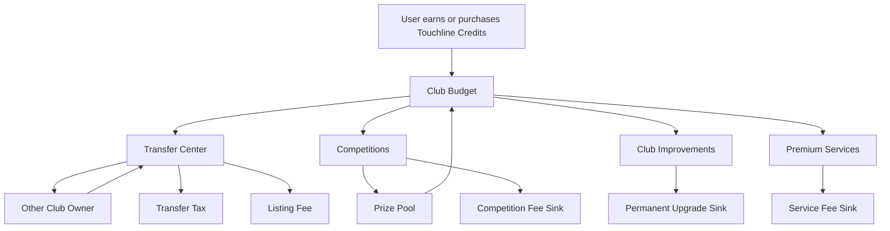
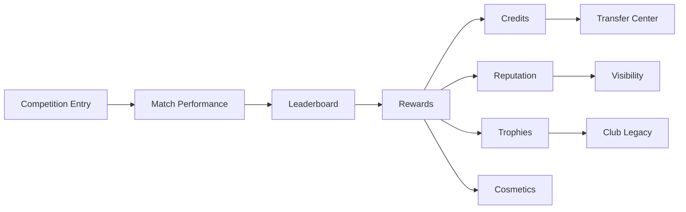
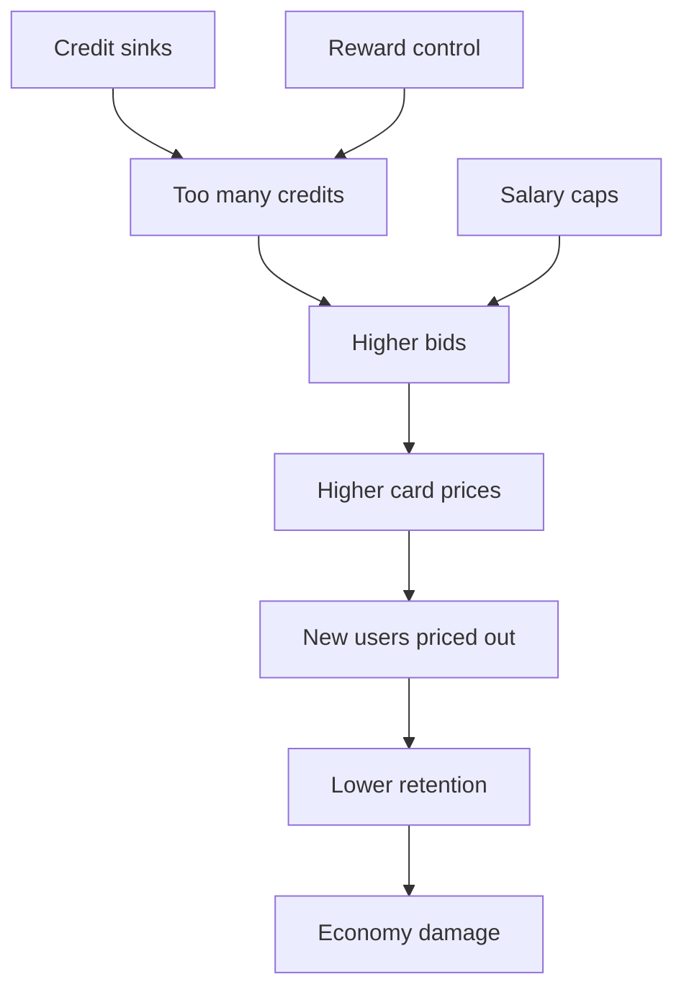

# Touchline Economy Bible

Version: 0.1  
Author: Touchline Executive Documentation Board  
Last Updated: 2026-06-26  
Status: Draft Constitution  
Dependencies: 00_Governance, 03_Fantasy, 05_Transfer_Center, 11_Roadmap, 12_Legal  
Future Related Documents: Touchline Credits, Club Owner Card System, Transfer Center Rules, Fantasy Competition Rules, Anti Pay-To-Win Policy, Marketplace Fee Model

## Executive Summary

The Touchline Economy is designed to make Touchline Fantasy feel like a living football business universe without becoming gambling, pay-to-win, or legally misleading.

The economy has three constitutional truths:

1. **Official Market Value belongs to the football data provider.**
   Touchline does not invent or manipulate official player value.

2. **Touchline Cards are digital platform assets.**
   They do not represent ownership of real football players, image rights, contracts, federative rights, investment rights, or real-world economic rights.

3. **Scarcity lives inside card availability, not official player value.**
   Touchline can control how many cards exist, but cannot change a player's official market value for game economy reasons.

The economy must reward long-term strategy, scouting, negotiation, competition success and club building. Money can improve experience, presentation and access to tools, but must never simply buy victory.

---

# 01 — Touchline Credits

## Objective

Touchline Credits are the internal economy currency used inside the Touchline Fantasy ecosystem.

Credits exist to power transfers, competition entry, special events, club upgrades and premium marketplace actions.

## Core Rule

Touchline Credits remain inside the Touchline ecosystem.

Credits are not gambling chips.

Credits are not a promise of financial return.

Credits do not represent ownership of real football assets.

## Uses

Credits can be used for:

- Buying Touchline Cards.
- Submitting transfer offers.
- Paying competition entry fees.
- Joining special events.
- Improving club facilities.
- Unlocking premium scouting insights.
- Paying transfer taxes or listing fees.
- Participating in auctions.

## Risks

- Users may misunderstand credits as money.
- Over-selling credits can create pay-to-win perception.
- Too many credits can inflate card prices.
- Too few credits can make the market feel dead.

## Constitutional Rule

Credits must create activity, not unfair domination.

---

# 02 — Official Market Value

## Objective

Official Market Value represents the real-world football valuation of a player according to the selected football data provider.

## Rule

Touchline never changes Official Market Value manually for fantasy balancing.

If the selected data provider says:

```text
Neymar = €8M
```

Touchline shows:

```text
Neymar = €8M
```

If the provider changes to:

```text
Neymar = €6M
```

Touchline updates automatically to:

```text
Neymar = €6M
```

## Why this exists

Official Market Value must be trusted.

If Touchline manipulates official value, the economy becomes artificial and loses football credibility.

## Dependencies

- Licensed or approved football data provider.
- Sync engine.
- Cache strategy.
- Data quality rules.
- Source confidence rules.

## Risks

- Provider values may be delayed.
- Provider may change methodology.
- Provider coverage may be incomplete.
- Users may disagree with values.

## Future Expansion

Touchline may add a separate **Fantasy Demand Value**, but it must be clearly separated from Official Market Value.

---

# 03 — Touchline Cards

## Objective

Touchline Cards are digital platform assets used in Touchline Fantasy.

They represent the right to use a player's fantasy card inside Touchline competitions and marketplaces.

## Legal Rule

Touchline Cards do not represent ownership of real football players.

They do not represent:

- Player contracts.
- Federative rights.
- Economic rights.
- Image rights.
- Transfer rights.
- Investment shares.
- Real-world claims.

## Card Categories

Card category is determined only by Official Market Value.

| Category | Official Market Value |
| --- | --- |
| Bronze | Below €5M |
| Silver | €5M to €49.99M |
| Gold | €50M or above |

## Automatic Border Rule

Card borders update automatically when Official Market Value changes.

Example:

- Player is worth €4.8M → Bronze.
- Provider updates value to €5.2M → Silver.
- Card border changes automatically.

## Risks

- Users may treat higher category as guaranteed better performance.
- Visual category may create market speculation.
- Category changes may shock users.

## Improvement

Add clear tooltips:

```text
Card category is based on official market value, not guaranteed fantasy performance.
```

---

# 04 — Card Availability

## Objective

Card availability controls scarcity.

Scarcity should never be created by changing official player value.

## Scarcity Types

- Total card supply.
- Edition supply.
- Competition eligibility.
- Seasonal availability.
- Transfer window restrictions.
- Special event access.

## Availability Rules

Touchline can control:

- How many cards of a player exist.
- Which editions are available.
- When new cards are released.
- Which competitions allow certain card types.

Touchline cannot control:

- The official market value.
- The real player's career.
- The real player's club decisions.

## Risks

- Too much scarcity creates frustration.
- Too little scarcity kills market value.
- Scarcity must not feel unfair or manipulated.

---

# 05 — Card Releases

## Objective

Card releases create excitement, discovery and market activity.

## Release Types

- Base season cards.
- Youth discovery cards.
- Breakout player cards.
- Tournament cards.
- Derby cards.
- Legacy cards.
- Special performance cards.
- Club edition cards.

## Release Rules

New releases must be predictable enough to feel fair and surprising enough to feel exciting.

## Recommended Release Rhythm

- Weekly small releases.
- Monthly featured drops.
- Seasonal major releases.
- Tournament special releases.
- Rare legacy events.

## Risks

- Too many releases inflate supply.
- Too many special editions confuse users.
- Overpowered editions create pay-to-win risk.

## Constitutional Rule

Special editions may look premium, but must not destroy competitive balance.

---

# 06 — Credit Flow

## Objective

Credit flow defines how credits enter, move through and leave the economy.

## Economy Diagram



## Credit Sources

- Starter budget.
- Competition rewards.
- Transfer sales.
- Daily objectives.
- Season rewards.
- Controlled credit purchases.
- Promotional events.

## Credit Sinks

- Transfer tax.
- Listing fees.
- Competition entries.
- Club upgrades.
- Cosmetic purchases.
- Premium analytics.
- Failed auction penalties.

## Healthy Economy

A healthy economy has:

- Credits entering slowly.
- Credits circulating between users.
- Credits leaving through controlled fees.
- Enough liquidity for transfers.
- Enough scarcity to preserve value.

---

# 07 — Transfer Center Economy

## Objective

The Transfer Center is the main marketplace for Touchline Cards.

## Secure Ecosystem Rule

All Touchline Card negotiations must happen exclusively inside the Touchline ecosystem.

The economy must prevent external market transactions because external deals damage:

- User safety.
- Credit circulation.
- Marketplace trust.
- Transfer history.
- Touchline revenue.
- Fraud protection.

## Transfer Assets

Club Owners can negotiate with:

- Touchline Cards.
- Touchline Credits.
- Player exchanges.
- Loans.
- Counter offers.
- Future clauses.
- Sell-on clauses.

## Marketplace Fees

Recommended fees:

- Listing fee: small fixed amount.
- Transfer tax: percentage of completed deal.
- Auction fee: small entry/listing cost.
- Cancellation penalty: only for abuse prevention.

## Risks

- Market manipulation.
- Fake bidding.
- Collusion between accounts.
- Price pumping.
- Credit laundering.

## Protections

- Transfer history.
- Suspicious activity detection.
- Cooldowns on repeated trades.
- Maximum daily transfer volume by tier.
- Trade review for unusual prices.
- AI message protection against off-platform transactions.
- Secure Negotiation Rooms for every proposal and counteroffer.

---

# 08 — Transfer Rules

## Objective

Create fair, predictable and exciting transfer rules.

## External Transaction Ban

Users may not share phone numbers, email addresses, WhatsApp, Telegram, Discord, Instagram, Facebook, X/Twitter, PIX, IBAN, PayPal, crypto wallets, QR codes or external payment requests for Touchline Card negotiations.

Attempts to move negotiations outside Touchline should be blocked and logged.

## Allowed Transfer Types

- Direct purchase.
- Negotiated offer.
- Counter offer.
- Player exchange.
- Loan.
- Loan with option.
- Sell-on clause.
- Buy-back clause.
- Auction.

## Transfer Statuses

- Draft.
- Sent.
- Viewed.
- Countered.
- Accepted.
- Rejected.
- Expired.
- Completed.
- Under review.

## Restrictions

Transfers may be blocked if:

- Card is locked in active competition.
- User does not have enough credits.
- Deal violates salary cap.
- Deal exceeds squad limit.
- Deal triggers suspicious activity rules.
- Player is temporarily unavailable.

---

# 09 — Buy Back Rules

## Objective

Buy-back rules protect users when external football events make cards ineligible.

## Core Rule

Touchline only buys back cards when players become ineligible because of external football events.

Touchline never compensates poor management.

## Eligible Buy-Back Events

Possible eligible events:

- Player retires from professional football.
- Player dies.
- Player is permanently banned by football authorities.
- Player leaves all supported competitions permanently.
- Player is removed from the official data provider.
- Player becomes legally unusable due to licensing restrictions.

## Non-Eligible Events

Touchline does not buy back cards because:

- User overpaid.
- Player lost form.
- Player got injured temporarily.
- Player changed club.
- Player lost market value.
- User made a bad trade.
- Player is benched.

## Buy-Back Value Formula

Recommended formula:

```text
Buy-back value = protected percentage of recent official reference value or platform-defined floor value
```

Exact percentage must be defined before launch.

## Risks

- Users may try to exploit retirement rumors.
- Buy-back could inject too many credits.
- Buy-back rules must be legally clear.

---

# 10 — Transfer Windows

## Objective

Transfer windows create rhythm, urgency and strategic planning.

## Window Types

- Pre-season window.
- Mid-season window.
- Deadline day.
- Emergency window.
- Youth discovery window.
- Special tournament window.

## Rules

During open windows:

- Full transfers allowed.
- Loans allowed.
- Auctions allowed.
- Exchanges allowed.

During closed windows:

- Limited free agent activity.
- Internal squad management.
- Watchlist and scouting.
- Pre-contract style offers for future windows.

## Risks

- Too many restrictions can frustrate casual users.
- Too few restrictions make the economy chaotic.

## Recommended Approach

Start with soft windows, then introduce stricter rules for advanced competitions.

---

# 11 — Squad Financial Rules

## Objective

Squad financial rules prevent rich users from hoarding all top cards.

## Rules

Each club should have:

- Squad size limit.
- Club budget.
- Salary cap.
- Transfer spending limit.
- Card registration limit.
- Competition-specific eligibility limits.

## Example

A competition may require:

- Maximum 3 Gold cards.
- Minimum 5 Bronze cards.
- Maximum squad official value.
- Maximum weekly salary total.

## Risks

- Too many rules may overwhelm users.
- Too few rules create pay-to-win.

---

# 12 — Salary Cap System

## Objective

The salary cap protects competitive balance.

## Rule

Every card should have a fantasy salary cost derived from:

- Official Market Value.
- Player category.
- Current form.
- Competition tier.
- Scarcity.

## Salary Cap Design

Salary cap can apply to:

- Weekly lineup.
- Full squad.
- Competition registration.

## Why it matters

Without salary caps, users with many credits can stack elite cards.

## Risks

- Salary formulas can become too complex.
- Users may feel punished for owning valuable cards.

## Improvement

Use simple visible cap numbers first. Add advanced rules later.

---

# 13 — Competition Rewards

## Objective

Competition rewards drive participation and long-term ambition.

## Reward Types

- Credits.
- Trophy history.
- Reputation.
- Special cards.
- Cosmetic items.
- Qualification.
- Club ranking points.

## Reward Rules

Rewards should favor:

- Performance.
- Consistency.
- Promotion.
- Smart squad building.
- Fair play.

Rewards should not overpay:

- Lucky one-week results.
- Exploit behavior.
- Pay-to-win users.

## Reward Diagram



---

# 14 — Club Budget

## Objective

Club Budget is the owner's available financial power inside the fantasy ecosystem.

## Budget Sources

- Starting allocation.
- Competition rewards.
- Card sales.
- Daily objectives.
- Season performance.
- Controlled credit purchase.

## Budget Uses

- Transfers.
- Squad registration.
- Competition entry.
- Club upgrades.
- Premium scouting.
- Cosmetic identity.

## Budget Rules

Budget should be visible, simple and strategic.

Users should always understand:

- How much they have.
- What they can afford.
- What they are risking.

---

# 15 — Club Owner Card Economy

## Objective

The Club Owner Card is the most prestigious economic identity object in Touchline Fantasy.

It turns the user's club into a visible status symbol based on financial strength, squad value, titles, ranking and long-term progression.

## Source Document

The full product rules live in:

```text
03_Fantasy/08_Club_Owner_Card_System.md
```

## Club Net Worth

Club Net Worth is calculated automatically.

Constitutional formula:

```text
Club Net Worth =
Cash
*
Official Market Value of all 35 registered players
*
Club Assets
*
Financial Obligations
```

## Economic Interpretation

Club Net Worth is an internal Touchline economic status metric.

It does not represent:

- Real-world club valuation.
- Real-world company shares.
- Legal ownership.
- Investment rights.
- Guaranteed cash-out value.

## Prestige Levels

Club Owner Card levels are based only on Club Net Worth.

| Level | Basis |
| --- | --- |
| Bronze | Entry-level Club Net Worth |
| Silver | Growing Club Net Worth |
| Gold | High Club Net Worth |
| Emerald | Elite Club Net Worth |
| Diamond | Top-tier Club Net Worth |

## Automatic Updates

The Club Owner Card updates when:

- Ranking changes.
- Credits change.
- Net Worth changes.
- Titles change.
- Squad Market Value changes.

## Anti Pay-To-Win Guardrail

Club Net Worth must not become a pure spending leaderboard.

The calculation should reward:

- Smart squad building.
- Competition success.
- Transfer profit.
- Long-term ownership.
- Financial discipline.
- Club development.

It should not reward only:

- Buying credits.
- Hoarding expensive cards.
- External transactions.

## Risk

Because Club Owner Card prestige is highly visible, users may try to inflate Net Worth artificially.

## Protections

- Salary cap.
- Transfer taxes.
- Market manipulation detection.
- External transaction ban.
- Suspicious trade review.
- Competition-based reputation weighting.

---

# 16 — Inflation Protection

## Objective

Protect the economy from uncontrolled price growth.

## Inflation Sources

- Too many credits entering.
- Too many rewards.
- Too few sinks.
- Hoarding.
- Market manipulation.
- Unlimited purchases.

## Protection Tools

- Transfer taxes.
- Listing fees.
- Salary caps.
- Competition entry fees.
- Limited rewards.
- Credit purchase limits.
- Seasonal recalibration.
- Anti-abuse monitoring.

## Inflation Diagram



## Constitutional Rule

If inflation rises, Touchline should first adjust sinks and rewards before changing card availability.

---

# 17 — Anti Pay-To-Win Rules

## Objective

Ensure Touchline Fantasy rewards skill and strategy, not only spending.

## Rules

1. Paid users must not be able to buy guaranteed victory.
2. Premium tools may improve insight, not force outcomes.
3. Competitive competitions must have squad limits.
4. Salary caps must prevent all-star stacking.
5. Cosmetic monetization is safer than competitive monetization.
6. Credit purchases should have limits.
7. Free users must be able to compete meaningfully.
8. External purchases or private off-platform deals are prohibited.
9. Every card transfer must be recorded inside Touchline.

## Better Monetization

Prefer selling:

- Club cosmetics.
- Stadium themes.
- Card frames.
- Analytics.
- Extra watchlists.
- Premium competitions.
- AI scouting reports.

Avoid selling:

- Guaranteed wins.
- Overpowered cards.
- Unlimited transfer power.
- Exclusive competitive advantage with no counterbalance.

---

# 18 — Daily Economy

## Objective

Create daily reasons to return.

## Daily Economy Loops

- Daily market movements.
- Transfer offers.
- Watchlist alerts.
- Player value updates.
- Scout discoveries.
- Club objectives.
- Competition preparation.
- Reward claims.

## Daily Objectives

Examples:

- Review 3 transfer targets.
- Submit 1 offer.
- Watchlist 2 players.
- Complete lineup.
- Check market movers.
- Scout one youth player.

## Risks

- Daily tasks can feel like chores.
- Rewards can inflate economy.

## Improvement

Daily objectives should reward engagement mostly with reputation, cosmetics and small controlled credits.

---

# 19 — Long Term Sustainability

## Objective

Make the economy healthy for years, not weeks.

## Sustainability Pillars

1. Controlled credit creation.
2. Strong credit sinks.
3. Fair competition rules.
4. Clear scarcity.
5. Trusted official values.
6. Non-pay-to-win monetization.
7. Transparent market history.
8. Anti-abuse systems.
9. Seasonal evolution.
10. Long-term club legacy.

## Future Expansion

- Club financial ratings.
- Youth academy economy.
- Sponsorship system.
- Stadium upgrades.
- Media rights simulation.
- Regional competitions.
- Club owner reputation.
- Dynasty mode.

---

# Risk Analysis

| Risk | Severity | Why it matters | Protection |
| --- | --- | --- | --- |
| Pay-to-win perception | Critical | Serious users leave if money buys victory. | Salary caps, credit limits, cosmetic monetization. |
| Inflation | Critical | Market becomes impossible for new users. | Credit sinks, taxes, controlled rewards. |
| Legal confusion | Critical | Users may think cards represent real player ownership. | Strong disclaimers and legal language. |
| Market manipulation | High | Users can pump prices or collude. | Trade monitoring and review rules. |
| Off-platform deals | Critical | Users can bypass Touchline, cause fraud and leak credits from the ecosystem. | AI message protection, blocked contact data, Secure Negotiation Rooms. |
| Too much complexity | High | New users may quit. | Progressive onboarding and simple starting rules. |
| Provider dependency | High | Official value depends on external data. | Multi-provider strategy and source confidence rules. |
| Scarcity abuse | Medium | Users may accuse platform of manipulating supply. | Transparent release rules. |
| Reward farming | Medium | Users may exploit daily objectives. | Anti-abuse limits and non-credit rewards. |

---

# Inflation Risks

## Highest Risk Areas

1. Too many credits sold directly.
2. Overpowered competition rewards.
3. No transfer tax.
4. No salary cap.
5. Too much card hoarding.
6. Too many special cards.

## Recommended Controls

- Start with conservative rewards.
- Add a marketplace fee from day one.
- Limit direct credit purchases.
- Use salary caps in competitive modes.
- Create non-credit rewards.
- Monitor average card price weekly.

---

# Long-Term Sustainability

The Touchline Economy should not be optimized for short-term spending.

It should be optimized for:

- Years of club building.
- Market trust.
- Fair competition.
- Smart trading.
- Emotional ownership.
- Daily engagement.
- Long-term identity.

The best users should feel:

```text
I built this club through smart football decisions.
```

Not:

```text
I bought the best squad.
```

---

# Recommended Future Improvements

## Phase 1

- Define credit sources and sinks.
- Define card categories.
- Define basic transfer rules.
- Define salary cap.
- Define official market value provider.

## Phase 2

- Add transfer taxes.
- Add listing fees.
- Add competition rewards.
- Add market history.
- Add card availability dashboard.

## Phase 3

- Add player loans.
- Add sell-on clauses.
- Add buy-back rules.
- Add weekly salary cap competitions.

## Phase 4

- Add advanced economy monitoring.
- Add anti-manipulation detection.
- Add seasonal economy reports.
- Add reputation-based market privileges.

## Phase 5

- Add dynasty economy.
- Add academy development economy.
- Add sponsorship economy.
- Add stadium economy.

---

# Final Constitution

Touchline Economy must always protect:

1. Official football value integrity.
2. Fair competition.
3. Long-term sustainability.
4. Legal clarity.
5. Strategic depth.
6. Anti pay-to-win balance.
7. User trust.
8. Secure in-platform transactions.

If any feature threatens these principles, it must be redesigned before development.
