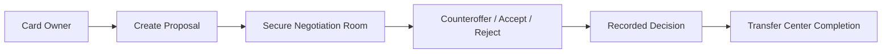

# Secure Transfer Policy

Version: 0.1  
Author: Touchline Executive Documentation Board  
Last Updated: 2026-06-26  
Status: Draft Constitution  
Dependencies: 04_Economy, 10_Security, 12_Legal  
Future Related Documents: Offer System, Counteroffer System, Deal Room Rules

## Transfer Center Rule

All Touchline Card negotiations must happen inside the Touchline Transfer Center.

No user may move a Touchline Card negotiation to WhatsApp, Telegram, email, Instagram, Discord, Facebook, X/Twitter, phone, PIX, IBAN, PayPal, crypto wallet, QR code or any other external payment/contact method.

## Secure Negotiation Room Requirement

Every proposal, counteroffer, acceptance and rejection must be recorded inside a Secure Negotiation Room.

## Official Negotiation Flow



## Why It Exists

The rule protects:

- Club Owners.
- Touchline Credits.
- Card availability.
- Marketplace fairness.
- Touchline revenue.
- Dispute resolution.

## Source of Truth

The full security enforcement policy lives in:

```text
10_Security/02_Secure_Transfer_Policy.md
```

