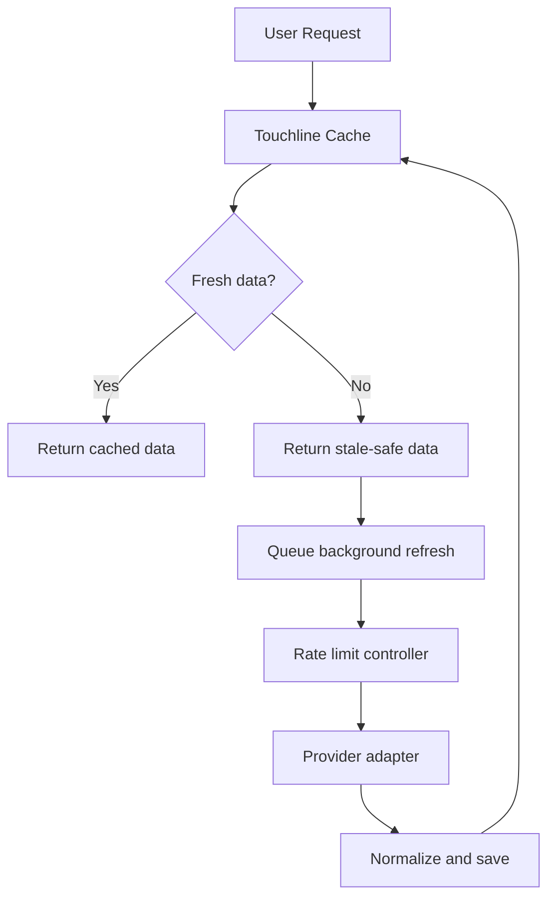
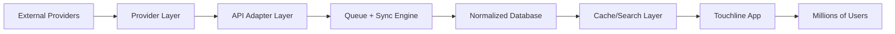

# Football Data Architecture Bible

Version: 0.1  
Author: Touchline Executive Documentation Board  
Last Updated: 2026-06-26  
Status: Draft Architecture  
Dependencies: 01_Data_Strategy, 03_API_Adapter, 04_Sync_Engine, 05_Cache_Strategy, 06_Rate_Limit, 07_Data_Quality, 07_Architecture, 08_Database  
Future Related Documents: Provider Matrix, Data Licensing Strategy, Live Match Data Strategy, Historical Data Warehouse, Search Infrastructure Plan

## Executive Summary

Touchline must never depend on one football data provider.

Sportmonks may be the first provider, but the architecture must support future providers such as Opta, Sportradar, Stats Perform, API-Football and others.

The football data architecture must be provider-independent, cache-first, rate-limit-safe, scalable to millions of users and legally disciplined.

The system must follow one golden rule:

```text
Touchline products read from Touchline's normalized data layer, not directly from external providers.
```

External providers feed Touchline. They do not control the application.

---

# 01 — Football Data Provider Layer

## Objective

The provider layer connects Touchline to external football data companies without making the product dependent on any single provider.

## Supported Provider Types

- Sportmonks.
- Opta.
- Sportradar.
- Stats Perform.
- API-Football.
- Future licensed providers.
- Internal verified Touchline data.

## Provider Responsibilities

Each provider connector should know:

- Authentication method.
- Endpoint structure.
- Rate limits.
- Coverage.
- Data freshness.
- Terms of use.
- Cost model.
- Error patterns.
- Supported entities.

## Provider Independence Rule

No product feature should directly depend on Sportmonks-specific field names, IDs or endpoint behavior.

Everything must pass through the adapter layer.

---

# 02 — API Adapter Layer

## Objective

The adapter layer converts provider-specific data into Touchline-standard football objects.

## Standard Objects

The adapter layer should normalize:

- Player.
- Club.
- Coach.
- Competition.
- Fixture.
- Match event.
- Lineup.
- Statistic.
- Transfer.
- Injury.
- Market value.
- National team.

## Adapter Output Rule

Every adapter output must include:

- `touchline_entity_type`
- `provider_name`
- `provider_entity_id`
- `provider_confidence`
- `source_updated_at`
- `normalized_payload`
- `raw_payload_reference`

## Why It Exists

If Touchline changes from Sportmonks to Opta later, the app should not need to be rewritten.

Only provider adapters should change.

---

# 03 — Sync Engine

## Objective

The sync engine decides what data is updated, when it is updated and how conflicts are handled.

## Sync Types

- Full sync.
- Incremental sync.
- Priority sync.
- Live sync.
- Manual admin sync.
- Recovery sync after failure.

## Sync Rules

1. Sync must be server-side.
2. Sync must respect provider rate limits.
3. Sync must log every job.
4. Sync must avoid duplicates.
5. Sync must not overwrite verified Touchline data with weaker external data.
6. Sync must support failover providers.

## Sync Priority

Highest priority:

- Live matches.
- Match events.
- Competition standings.
- Injury updates.
- Player transfers.

Medium priority:

- Player profiles.
- Club profiles.
- Squads.
- Coaches.

Low priority:

- Historical stats.
- Old transfers.
- Archived competitions.

---

# 04 — Background Jobs

## Objective

Background jobs keep Touchline updated without forcing users to wait for external APIs.

## Job Types

- Static data sync.
- Daily data sync.
- Matchday data sync.
- Live match sync.
- Historical backfill.
- Failed job retry.
- Provider health check.
- Cache warming.
- Duplicate detection.
- Data quality review.

## Job Scheduling Rule

Users should rarely trigger external API calls directly.

Instead:

```text
User request → Touchline cache/database → background refresh if stale
```

## Risks

- Too many jobs can exceed provider limits.
- Failed jobs can leave data stale.
- Large historical jobs can become expensive.

---

# 05 — Queue System

## Objective

The queue system controls job volume, retry behavior and priority.

## Queue Types

- High priority live queue.
- Matchday queue.
- Daily sync queue.
- Historical queue.
- Low priority enrichment queue.
- Manual admin queue.

## Priority Rules

1. Live match data first.
2. Active competitions second.
3. User-visible stale profiles third.
4. Historical data last.

## Retry Rules

- Retry transient failures.
- Back off after repeated failures.
- Stop retrying if provider returns permanent errors.
- Log failures for admin review.

---

# 06 — Caching

## Objective

Caching allows Touchline to support millions of users while minimizing external API usage.

## Cache Strategy

Use multiple cache layers:

1. Browser/UI cache.
2. Server response cache.
3. Database cache.
4. Search index cache.
5. Live match memory cache.
6. CDN/image cache.

## Cache First Rule

The app should almost always read from Touchline's stored data first.

External APIs should update the cache, not serve every user request.

## Cache TTL by Data Type

| Data Type | Recommended Freshness |
| --- | --- |
| Static player identity | Weekly or when changed |
| Club identity | Weekly or when changed |
| Historical stats | Monthly or after provider correction |
| Daily market data | Daily |
| Squads | Daily during season, more often during transfer windows |
| Fixtures | Daily, hourly near matchday |
| Matchday lineups | 5-15 minutes before match |
| Live events | 5-30 seconds depending on plan |
| Standings | During/after matchday |

---

# 07 — Database Strategy

## Objective

The database stores normalized, provider-independent football data.

## Data Layers

### 1. Touchline Verified Data

Data created or verified inside Touchline.

Examples:

- Verified agent relationships.
- User-submitted documents.
- Club-created opportunities.
- Touchline Fantasy ownership.

### 2. Normalized Provider Data

Cleaned data from external providers.

### 3. Raw Provider References

Raw payload references for audit/debug, not product display by default.

### 4. Historical Snapshots

Time-based records of changes.

## Database Rules

- Never mix verified Touchline relationships with unverified provider suggestions.
- Store source and confidence.
- Store last synced date.
- Store provider IDs.
- Store internal Touchline IDs separately.
- Support multiple provider IDs per entity.

---

# 08 — Rate Limit Protection

## Objective

Protect Touchline from provider bans, high costs and unstable data.

## Protection Rules

- Search local database first.
- Batch provider requests.
- Cache aggressively.
- Use background sync.
- Use exponential backoff.
- Respect provider quotas.
- Separate live data from historical data.
- Avoid duplicate fetches.

## Rate Limit Diagram



---

# 09 — Live Sync

## Objective

Live sync powers matchday experiences without overloading providers.

## Live Data Types

- Goals.
- Assists.
- Cards.
- Substitutions.
- VAR events.
- Injuries.
- Lineups.
- Player ratings.
- Match clock.
- Standings changes.

## Live Sync Frequencies

| Situation | Frequency |
| --- | --- |
| No live match | No live polling |
| Pre-match lineup window | Every 1-5 minutes |
| Active match basic plan | Every 30-60 seconds |
| Active match premium plan | Every 5-15 seconds |
| Post-match | Every 5-10 minutes until finalized |

## Scaling Rule

One provider request should serve many users.

Never poll the provider separately for every user watching the same match.

---

# 10 — Historical Data

## Objective

Historical data powers player profiles, club history, rankings, analytics and storytelling.

## Historical Data Types

- Player career history.
- Club squad history.
- Transfer history.
- Competition history.
- Match statistics.
- Trophy history.
- Market value history.

## Sync Approach

Historical data should be backfilled gradually.

Do not sync the entire world at once.

Recommended priority:

1. User-searched entities.
2. Top leagues.
3. Active fantasy competitions.
4. Popular clubs.
5. Historical archive.

---

# 11 — Data Validation

## Objective

Protect Touchline from wrong, duplicated or low-quality data.

## Validation Rules

Each normalized entity should validate:

- Required fields.
- Provider ID.
- Entity type.
- Source date.
- Country/league consistency.
- Duplicate candidates.
- Confidence score.
- Data freshness.

## Relationship Validation

Relationships need extra caution:

- Player-agent relationships are suggestions until verified.
- Club-player relationships should be time-bound.
- Coach-club relationships should be date-bound.
- Transfers must have source and date.

---

# 12 — Data Versioning

## Objective

Track changes over time.

## Versioned Data

- Player club.
- Player market value.
- Player injury status.
- Player contract date.
- Club squad.
- Coach appointment.
- Competition standings.
- Card category.

## Why It Matters

Versioning allows:

- Audit history.
- Market graphs.
- Fantasy card category changes.
- Dispute resolution.
- Data rollback.

---

# 13 — Provider Failover

## Objective

Keep Touchline running when one provider fails.

## Failover Strategy

Provider priority should be configurable:

```text
Primary Provider → Secondary Provider → Cache → Stale Safe Display
```

## Failover Rules

- Do not switch providers silently for critical values without source tracking.
- Show data source in admin tools.
- Compare provider confidence.
- Never overwrite verified data with lower-confidence data.

## Example

If Sportmonks fails during matchday:

1. Try secondary provider.
2. Use last known cache.
3. Mark live data as delayed.
4. Alert admins.

---

# 14 — Update Frequencies

## Static Data

Examples:

- Player identity.
- Club identity.
- Stadium.
- Country.
- Competition identity.

Recommended update:

- Weekly.
- On user request if stale.
- Manual admin sync.

## Daily Data

Examples:

- Squads.
- Injuries.
- Transfers.
- Market values.
- Rankings.

Recommended update:

- Once per day.
- More often during transfer windows.

## Matchday Data

Examples:

- Fixtures.
- Lineups.
- Match status.
- Competition standings.

Recommended update:

- Morning matchday sync.
- Pre-match sync.
- Post-match final sync.

## Live Data

Examples:

- Goals.
- Assists.
- Cards.
- Match clock.
- Live ratings.

Recommended update:

- 5-60 seconds depending on product tier and provider cost.

---

# 15 — Supporting Millions of Users

## Objective

Support massive scale without massive API cost.

## Core Strategy

Touchline must serve users from its own normalized data layer.

External providers update Touchline. Users do not hit providers directly.

## Scaling Principles

1. Cache first.
2. Queue provider requests.
3. Batch sync jobs.
4. Use search indexes.
5. Share live match polling across all viewers.
6. Pre-warm popular data.
7. Prioritize active competitions.
8. Use stale-safe displays.
9. Separate live and historical infrastructure.
10. Add provider failover.

## High Scale Diagram



## Rule

If 100,000 users watch the same match, Touchline should not make 100,000 provider requests.

It should make a controlled number of provider requests, cache the result and broadcast or serve it internally.

---

# 16 — Architecture Risks

| Risk | Severity | Protection |
| --- | --- | --- |
| Provider dependency | Critical | Multi-provider adapter layer |
| API cost explosion | Critical | Cache-first architecture and queues |
| Live data delay | High | Priority live queue and provider failover |
| Bad provider data | High | Validation, source confidence, admin review |
| Duplicate entities | High | Entity resolution and provider ID mapping |
| Rate limit ban | High | Rate limit controller and backoff |
| Stale data | Medium | Freshness labels and sync jobs |
| Over-complexity | Medium | Start with core data, expand by priority |

---

# 17 — Final Architecture Principle

Touchline must own the user experience and normalized data model.

Providers supply data.

Providers must never define the product.

The architecture must allow Touchline to replace, combine or downgrade providers without breaking the platform.

