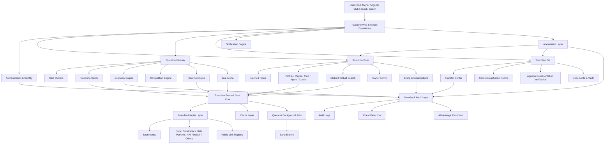
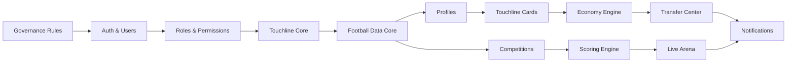
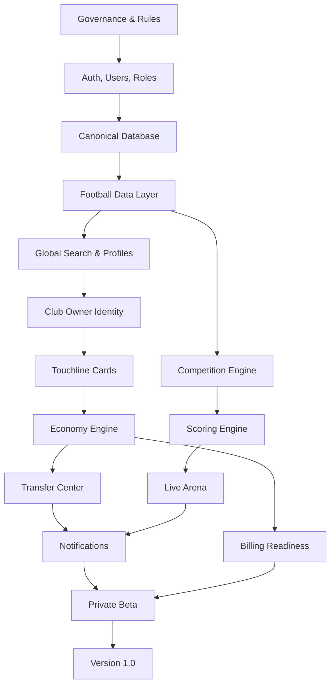

# Master System Architecture

Version: 0.1  
Author: Touchline Executive Architecture Board  
Last Updated: 2026-06-26  
Status: Draft Engineering Blueprint  
Dependencies: 00_Governance, 03_Fantasy, 04_Economy, 05_Transfer_Center, 06_Football_Data, 08_Database, 09_UI_UX, 10_Security, 11_Roadmap, 12_Legal  
Future Related Documents: Frontend Architecture, Backend Architecture, API Contract Bible, Queue Architecture, Search Architecture, AI Architecture, Deployment Architecture

## Executive Summary

Touchline is ready to move from vision planning into controlled engineering preparation, but it should not begin feature implementation randomly.

The approved Touchline HQ documents define a product with three connected layers:

1. **Touchline Core** — identity, users, clubs, players, search, profiles, permissions, billing, admin and operational tools.
2. **Touchline Fantasy** — Club Owners, Touchline Cards, economy, competitions, Transfer Center, Live Arena and long-term progression.
3. **Touchline Pro** — professional football workflows for agents, clubs, scouts, coaches and verified relationships.

The architecture must be modular from day one. Touchline cannot be built as one large app where every feature directly touches every table and API. The correct architecture is a layered system:

```text
Product Experience
↓
Application Modules
↓
Domain Services
↓
Data Access Layer
↓
Football Data Provider Layer
↓
Infrastructure
```

The most important architectural principle is this:

> Touchline must own its internal domain model, while external football providers only enrich that model.

Sportmonks, Transfermarkt links, API-Football, Opta, Sportradar or future providers must never become the architecture. They are adapters. Touchline is the product.

## Master Architecture Diagram



## 1. System Overview

### Touchline Core

Touchline Core is the base operating system. It owns:

- users
- roles
- profiles
- global search
- navigation
- admin
- billing
- notifications
- common permissions
- shared UI shell

Nothing advanced should be built before Core is stable.

### Touchline Fantasy

Touchline Fantasy is the entertainment and retention layer. It owns:

- Club Owner identity
- Touchline Cards
- competitions
- league progression
- Live Arena
- fantasy economy
- scoring
- rewards
- long-term progression

Fantasy depends on Core, Football Data, Economy, Security and Database foundations.

### Touchline Pro

Touchline Pro is the professional football business layer. It owns:

- agents
- clubs
- scouts
- players
- representation verification
- deal rooms
- document vaults
- professional negotiation workflows

Touchline Pro can share the same profiles and data foundation as Fantasy, but should have separate permissions and product flows.

### Transfer Center

Transfer Center connects Fantasy and Pro.

In Fantasy, it handles Touchline Card transfers.

In Pro, it supports professional opportunities, interest, proposals and negotiation rooms.

The architecture must separate:

- fantasy card transaction
- professional real-world representation conversation

They can look connected in the UI, but they are different legal systems.

### Live Arena

Live Arena depends on:

- Football Data Layer
- Competition Engine
- Scoring Engine
- Notification Engine
- UI Animation System

Live Arena must never call football providers directly from the frontend. It reads Touchline normalized live state.

### Football Data Layer

The Football Data Layer is provider-independent. It stores:

- normalized players
- normalized clubs
- coaches
- fixtures
- competitions
- statistics
- official market values
- external IDs
- sync status
- provider confidence

Provider data flows through adapters into Touchline's internal model.

### AI Layer

AI exists as an assistant and protection layer. It may:

- generate summaries
- assist onboarding
- explain rules
- recommend opportunities
- help draft documents
- detect unsafe messages
- detect off-platform negotiation attempts

AI must not:

- change official market values
- create unauthorized transfers
- bypass security
- make final legal decisions
- override football provider truth
- execute economy transactions without deterministic validation

### Payments

Payments include:

- subscriptions
- premium services
- possible credit purchases, if approved by the economy rules

Payment systems must be isolated from internal fantasy credits. Real money and Touchline Credits must be legally and technically separated.

### Notifications

Notifications are a cross-system service:

- transfer offers
- counter offers
- match events
- competition results
- rewards
- verification alerts
- security warnings
- billing events

Notifications must be event-driven, not manually scattered across feature code.

## 2. Module Architecture

| Module | Purpose | Depends On | Must Own |
| --- | --- | --- | --- |
| Authentication | Login, registration, sessions | Users, Security | Identity trust |
| Users | Account records and role assignment | Authentication | User profile root |
| Roles & Permissions | Owner, admin, club owner, agent, club, scout, coach | Users, Security | Access control |
| Club Owners | Fantasy owner identity | Users, Clubs, Economy | Owner progression |
| Clubs | Club profiles and fantasy/pro club records | Football Data, Club Owners | Club identity |
| Players | Player profiles and data | Football Data | Player canonical record |
| Coaches | Coach profiles and selection | Football Data, Clubs | Coach identity |
| Touchline Cards | Digital platform assets | Players, Economy, Club Owners | Card availability and lifecycle |
| Transfer Center | Offers, counter-offers, loans, clauses | Cards, Economy, Security | Negotiation state |
| Economy Engine | Credits, budgets, caps, rewards | Cards, Transfers, Competitions | Financial integrity |
| Competition Engine | Leagues, cups, qualification, seasons | Clubs, Cards, Scoring | Competitive structure |
| Scoring Engine | Position-specific scoring | Football Data, Live Arena | Score calculation |
| Live Arena | Matchday experience | Football Data, Scoring, Competitions | Live presentation state |
| Football Data Sync Engine | Provider ingestion | Adapter Layer, Cache, Queue | Data freshness |
| Notification Engine | Alerts and engagement | Events, Users | Delivery workflow |
| AI Engine | Assistant and protection | Core, Security, Data | AI workflows |
| Admin | Owner control and system visibility | Users, Roles, Audit | Operational control |
| Billing | Subscriptions and invoices | Users, Security | Payment state |
| Security | Policy enforcement | All modules | Trust boundary |
| Audit Logs | Immutable historical actions | Security, Economy, Transfers | Evidence trail |

## 3. Dependency Map

### Foundational Dependencies



### Must Be Built First

1. Authentication and roles.
2. Canonical users, clubs, players and external IDs.
3. Football Data Core and provider adapter contract.
4. Audit logs.
5. Admin visibility.
6. Search and profile shell.

### Can Be Developed in Parallel

After the foundations exist:

- frontend design system
- football provider adapter implementation
- notification templates
- profile pages
- admin dashboards
- documentation and QA plans

### Must Not Be Built Too Early

- full economy marketplace
- competitions
- live arena
- advanced AI automation
- paid credit flows
- public launch billing gates

These systems become dangerous if built before data trust, audit logs and permissions exist.

## 4. Official Development Order

### Phase 0 — Engineering Readiness

Purpose: prepare development discipline before code expansion.

Build:

- branch strategy
- coding standards
- environment rules
- QA checklist
- seed data policy
- architecture decision record process

Why it exists:

Touchline is too ambitious to build by improvisation.

### Phase 1 — Core Stabilization

Build:

- authentication
- owner/admin role
- user role separation
- protected layouts
- navigation cleanup
- shared UI shell
- error handling
- system health truth checks

Why it exists:

Every future system depends on stable identity and stable navigation.

### Phase 2 — Canonical Database Foundation

Build:

- canonical users
- club owners
- clubs
- players
- coaches
- external provider IDs
- audit logs
- provider sync status
- public link registry

Why it exists:

Touchline must stop treating external data as direct app data.

### Phase 3 — Football Data Layer

Build:

- provider adapter contract
- Sportmonks adapter
- cache-first read layer
- sync jobs
- rate limit protection
- data quality validation
- provider mapping

Why it exists:

This creates the reusable football brain of the company.

### Phase 4 — Global Search and Profiles

Build:

- global search by player, club, agent, agency and coach
- search result type filters
- canonical profile pages
- share buttons
- external links
- profile completeness indicators
- trusted metadata display

Why it exists:

Search is the front door of the football network.

### Phase 5 — Club Owner MVP

Build:

- owner onboarding
- club creation
- starter budget
- owner card shell
- owner profile
- club dashboard
- basic progression

Why it exists:

This is the first emotional identity loop.

### Phase 6 — Touchline Cards and Economy Core

Build:

- card lifecycle
- Bronze/Silver/Gold category rules
- official value sync
- card availability
- credit ledger
- club bank
- salary cap
- inflation controls

Why it exists:

Economy must be deterministic before transfers are allowed.

### Phase 7 — Transfer Center

Build:

- offers
- counter-offers
- loans
- exchanges
- future clauses
- sell-on clauses
- secure negotiation rooms
- AI message protection
- audit trail

Why it exists:

Transfer Center is the heart of daily activity and revenue protection.

### Phase 8 — Competitions and Scoring

Build:

- domestic leagues
- cup structure
- match squads
- scoring engine
- rankings
- rewards
- promotion/relegation

Why it exists:

Competition gives the economy purpose.

### Phase 9 — Live Arena

Build:

- live match state
- live scoring UI
- card animations
- event timeline
- live ranking changes
- notification triggers

Why it exists:

Live Arena creates matchday addiction and emotional peaks.

### Phase 10 — Monetization and Beta

Build:

- subscription gates
- premium competitions
- billing portal
- invoices
- terms acceptance
- beta invite control
- operational dashboards

Why it exists:

Monetization must be added only when the product loop is worth paying for.

### Phase 11 — Version 1.0 Launch

Build:

- production monitoring
- support workflows
- launch analytics
- legal readiness
- scalable infrastructure
- final QA
- public launch onboarding

Why it exists:

Version 1.0 is not the first working prototype. It is the first trustworthy public business.

## 5. Database Dependency Order

### Table Creation Order

1. **users**
2. **roles**
3. **user_roles**
4. **audit_logs**
5. **external_providers**
6. **external_entity_mappings**
7. **countries**
8. **competitions**
9. **clubs**
10. **players**
11. **coaches**
12. **club_owners**
13. **club_owner_clubs**
14. **player_statistics**
15. **club_statistics**
16. **football_data_sync_logs**
17. **touchline_cards**
18. **card_ownership_history**
19. **credit_accounts**
20. **credit_ledger**
21. **club_banks**
22. **transfer_rooms**
23. **transfer_offers**
24. **transfer_offer_items**
25. **transfer_audit_events**
26. **secure_messages**
27. **competitions_seasons**
28. **competition_participants**
29. **fixtures**
30. **lineups**
31. **scoring_events**
32. **live_arena_events**
33. **notifications**
34. **billing_customers**
35. **subscriptions**
36. **invoices**
37. **admin_actions**

### Data That Should Never Be Duplicated

- official player identity
- official club identity
- official market value
- external provider IDs
- user identity
- credit balance as a mutable number without ledger support
- card ownership without history
- transfer acceptance state

Balances may be cached for speed, but the ledger is the truth.

### Canonical Data Rule

Every external provider record must map into a Touchline canonical entity.

Example:

```text
Sportmonks Player ID
Transfermarkt Link ID
API-Football Player ID
↓
Touchline Player ID
```

The Touchline Player ID is the internal truth. Provider IDs are references.

## 6. API Dependency Order

### Step 1 — Internal API Contracts

Before adding provider complexity, define internal API contracts:

- search
- profile read
- profile update
- football data read
- sync status
- card read
- transfer offer
- notification read

### Step 2 — Sportmonks Introduction

Sportmonks should be introduced only after:

- provider mapping exists
- cache layer exists
- sync logs exist
- rate limit rules exist
- data quality rules exist

Sportmonks should first power:

- clubs
- players
- competitions
- fixtures
- basic statistics

It should not immediately power economy-critical logic until validation is proven.

### Step 3 — Caching Begins

Caching begins before live usage.

Required cache categories:

- static football entities
- profile summaries
- search results
- live fixture snapshots
- market value snapshots
- competition tables

### Step 4 — Background Sync Begins

Background sync begins after:

- sync logs exist
- retry rules exist
- provider adapters exist
- rate limits exist
- stale data policy exists

### Step 5 — Provider Replaceability

Providers remain replaceable through:

- adapter interface
- normalized response objects
- external mapping table
- provider priority rules
- provider confidence scoring
- fallback logic

Frontend must never know whether data came from Sportmonks, Opta or another provider.

## 7. Frontend Architecture

### Frontend Layers

```text
App Shell
↓
Routes / Pages
↓
Feature Modules
↓
Shared Components
↓
Design Tokens
↓
Data Hooks / Server Actions
```

### Page Communication

Pages should not call each other directly.

They communicate through:

- URL state
- shared domain services
- cache invalidation
- event notifications
- canonical IDs

### Reusable Components

Core reusable UI:

- profile hero
- entity card
- search result card
- status badge
- rating badge
- market value display
- trophy card
- transfer offer card
- notification item
- live event row
- owner card
- player card
- club card

### Live Arena to Fantasy Connection

Live Arena reads:

- fixtures
- lineups
- scoring events
- player card ownership
- club owner rosters

It writes:

- live score snapshots
- ranking updates
- reward eligibility
- notifications

It does not calculate economy balances directly.

### Transfer Center to Economy Connection

Transfer Center creates proposed transactions.

Economy Engine validates and executes accepted transactions.

Transfer Center must never directly mutate credit balances or ownership.

### Club Owner as Central Product Identity

Club Owner connects to:

- club
- owner card
- Touchline Credits
- club bank
- squad cards
- competitions
- Transfer Center
- achievements
- rankings

Club Owner is the main daily identity in Fantasy.

## 8. Backend Architecture

### Services

Recommended service boundaries:

- Auth Service
- User Service
- Role Service
- Football Data Service
- Search Service
- Profile Service
- Card Service
- Economy Service
- Transfer Service
- Competition Service
- Scoring Service
- Live Arena Service
- Notification Service
- AI Safety Service
- Billing Service
- Admin Service
- Audit Service

These can start inside one codebase, but their boundaries must be clear.

### Queues

Use queues for:

- provider sync
- image enrichment
- profile enrichment
- notification fanout
- scoring recalculation
- competition table recalculation
- AI moderation
- report generation
- billing webhook processing

### Workers

Workers should handle slow or repeated tasks:

- daily football data sync
- matchday live sync
- provider retry
- card category recalculation
- owner net worth recalculation
- leaderboard updates
- stale data detection

### Sync Jobs

Sync jobs must be:

- idempotent
- logged
- rate-limited
- retryable
- provider-aware
- safe to stop and resume

### Caching

Cache strategy:

- CDN for public static assets
- server cache for provider responses
- database materialized views for rankings
- short TTL cache for live data
- longer TTL cache for static metadata

### Background Tasks

Background tasks must not bypass authorization. They operate with system identity and every mutation must create an audit event.

## 9. Mobile Strategy

### Desktop

Desktop is command-center first.

Prioritize:

- side navigation
- dashboard density
- tables
- transfer negotiation panels
- live arena multi-panel layout
- admin operations

### Tablet

Tablet is hybrid.

Prioritize:

- two-column layouts
- swipeable panels
- collapsible sidebar
- readable cards
- large touch targets

### Mobile

Mobile is action-first.

Prioritize:

- bottom navigation or compact top navigation
- one primary action per screen
- stacked profile cards
- search-first UX
- notification-first re-entry
- fast Transfer Center actions
- Live Arena as a vertical feed

Mobile must not attempt to show desktop density. It must preserve emotional quality with fewer elements.

## 10. Performance Strategy

### 10,000 Users

Architecture requirements:

- cache search results
- paginate all lists
- lazy-load heavy profile sections
- use background jobs for sync
- basic monitoring

### 100,000 Users

Architecture requirements:

- queues for all slow tasks
- read replicas or optimized read models
- materialized rankings
- provider response caching
- event-driven notifications
- strict rate limiting

### 1 Million Users

Architecture requirements:

- split read/write workloads
- dedicated search engine
- regional CDN
- partition high-volume tables
- event streaming for live arena
- isolated workers for matchday traffic
- provider failover
- financial ledger performance strategy

The architecture can reach 1 million users without rewriting if the domain boundaries are respected from the start.

## 11. Security Strategy

### Authentication

Authentication must support:

- email/password
- OAuth where configured
- secure sessions
- password reset
- account recovery
- device/session management in future

### Authorization

Authorization must be role-based and resource-based.

Roles:

- owner
- admin
- club owner
- agent
- club professional
- scout
- coach
- player
- support

Resource checks:

- owns club
- owns card
- is negotiation participant
- can view document
- can manage billing
- can approve verification

### API Protection

Every sensitive API requires:

- authenticated user
- role check
- input validation
- rate limit
- audit event for mutations

### Audit Logs

Audit logs are mandatory for:

- economy changes
- card ownership changes
- transfer actions
- role changes
- admin actions
- billing webhooks
- security warnings
- AI moderation decisions

### Fraud Detection

Fraud detection should monitor:

- repeated external contact attempts
- suspicious transfer patterns
- abnormal credit movement
- multi-account abuse
- off-platform payment language
- marketplace manipulation

### Transfer Protection

All card negotiations must remain inside Touchline.

The AI Message Protection System blocks:

- phone numbers
- emails
- WhatsApp
- Telegram
- Discord
- Instagram
- Facebook
- X/Twitter
- PIX
- IBAN
- PayPal
- crypto wallets
- QR codes
- external payment requests

## 12. AI Strategy

### Where AI Exists

AI may exist in:

- onboarding assistant
- profile summarization
- document drafting
- opportunity explanation
- scouting report generation
- player comparison
- fraud detection support
- secure message protection
- support assistant
- search intent understanding

### Where AI Must Never Interfere

AI must not:

- change official market value
- finalize a transfer
- adjust credit balances
- determine legal ownership
- override provider data without review
- bypass user consent
- reveal private data across roles
- silently punish users without logged rules

### Future AI Roadmap

1. AI explanations and summaries.
2. AI onboarding.
3. AI search interpretation.
4. AI document assistant.
5. AI moderation.
6. AI opportunity recommendations.
7. AI career mode storytelling.
8. AI avatar and presentation generation.

AI should begin as assistive, not autonomous.

## 13. Technical Risks

| Risk | Why It Matters | Mitigation |
| --- | --- | --- |
| Building features before canonical data | Creates duplicates and wrong relationships | Build database foundation first |
| Provider lock-in | One provider can limit pricing, coverage or reliability | Adapter layer and external mappings |
| Economy bugs | Can damage trust immediately | Ledger-first architecture and audit logs |
| Weak role permissions | Private data leaks | Resource-level authorization |
| Live data cost explosion | Matchday traffic can become expensive | Cache, queues and sync snapshots |
| AI overreach | Legal and trust risk | AI cannot execute critical actions |
| Search quality problems | Users lose confidence quickly | Dedicated search strategy and ranking rules |
| Mobile overload | Product feels unusable | Mobile action-first layouts |
| Off-platform transaction leakage | Revenue and fraud risk | Secure Transfer Policy and AI Message Protection |
| Premature monetization | Users pay before value loop is strong | Monetize after core loop proves retention |

## Dependency Diagram



## Engineering Roadmap

### Immediate Engineering Sequence

1. Stabilize current app shell, auth, roles and admin.
2. Define canonical domain models.
3. Implement audit-first database foundation.
4. Build Football Data adapter interfaces.
5. Build Global Search around canonical entities.
6. Build profile pages for player, club, agent, agency and coach.
7. Build Club Owner onboarding.
8. Build Touchline Card lifecycle.
9. Build Economy ledger.
10. Build Transfer Center.
11. Build Competitions and Live Arena.
12. Add monetization.
13. Run private beta.
14. Launch Version 1.0.

## Module Roadmap

| Order | Module | Build Timing |
| --- | --- | --- |
| 1 | Auth, Users, Roles | Phase 1 |
| 2 | Audit Logs | Phase 1 |
| 3 | Canonical Football Entities | Phase 2 |
| 4 | Provider Adapter Layer | Phase 3 |
| 5 | Search and Profiles | Phase 4 |
| 6 | Club Owner | Phase 5 |
| 7 | Touchline Cards | Phase 6 |
| 8 | Economy Engine | Phase 6 |
| 9 | Transfer Center | Phase 7 |
| 10 | Secure Negotiation Rooms | Phase 7 |
| 11 | Competition Engine | Phase 8 |
| 12 | Scoring Engine | Phase 8 |
| 13 | Live Arena | Phase 9 |
| 14 | Billing and Monetization | Phase 10 |
| 15 | Beta and Launch Operations | Phase 10–11 |

## Risk Report

### Highest Risk

The highest risk is building beautiful UI and exciting fantasy mechanics before data, permissions, economy ledger and audit architecture are stable.

### Medium Risk

Provider data quality and provider cost may become a constraint if caching and sync design are delayed.

### Lower Risk

Visual polish and avatar systems can evolve later if the component architecture is prepared.

## Recommended Engineering Strategy

Touchline should be built as a modular monolith first.

This means:

- one main application
- clear internal module boundaries
- shared database
- service-style domain separation
- queue/background worker support
- provider adapters
- audit-first mutations

Do not start with microservices. Microservices would slow the company down before product-market fit.

Design modules as if they could become services later, but keep delivery speed high now.

## Definition of Ready for Development

Development is ready only when these are true:

- Governance rules are accepted.
- Master System Architecture is accepted.
- Database Master Bible is accepted.
- Football Data Architecture is accepted.
- Secure Transfer Policy is accepted.
- Economy Bible is accepted.
- UX Bible is accepted.
- Master Development Roadmap is accepted.
- First implementation phase is selected.
- Scope for tomorrow morning is limited to foundational engineering.

## Executive Recommendation

If I were the CTO of Touchline, the engineering team would build first tomorrow morning:

> A stable Touchline Core foundation: authentication, roles, owner/admin access, canonical user model, audit logs, protected navigation and the canonical football entity model for players, clubs, coaches, agents and external provider IDs.

This is not the flashiest work, but it is the work that prevents the entire product from becoming fragile.

## Is Touchline Ready to Begin Software Development?

Yes — Touchline is ready to begin controlled software development.

But Touchline is not ready to begin every feature at once.

Development should start with:

1. Core identity and roles.
2. Canonical database foundation.
3. Audit logs.
4. Provider-independent football entity model.
5. Global Search and profile architecture.

The first development sprint should not build the full Fantasy economy, Transfer Center or Live Arena yet.

Those systems are now architecturally defined, but they depend on the foundation above.

The correct first development rule is:

> Build trust and data truth before building the game economy.

