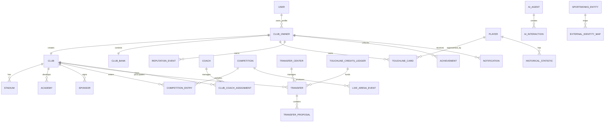

# Database Master Bible

Version: 0.1  
Author: Touchline Executive Documentation Board  
Last Updated: 2026-06-26  
Status: Draft Architecture  
Dependencies: 02_Product, 03_Fantasy, 04_Economy, 05_Transfer_Center, 06_Football_Data, 07_Architecture, 10_Security  
Future Related Documents: Entity Relationship Model, RLS Policy Rules, Search Strategy, Data Warehouse Strategy, Audit Log Strategy

## Executive Summary

The Touchline database must become the trusted football business graph.

It must support two connected worlds:

1. **Touchline Professional** — real football agents, clubs, players, documents, representation, opportunities and negotiations.
2. **Touchline Fantasy** — Club Owners, Touchline Cards, credits, competitions, Live Arena, transfers and long-term progression.

The database must never treat external provider data as absolute truth without source, version and confidence.

The database must separate:

- Verified Touchline data.
- External provider data.
- User-created data.
- Fantasy economy data.
- Historical snapshots.
- Audit records.

---

# 01 — Core Database Principles

## Principles

1. Every entity must have a stable internal Touchline ID.
2. External provider IDs must be stored separately.
3. Verified relationships must be separated from suggested relationships.
4. Financial/economy events must be auditable.
5. Transfers must be immutable after completion.
6. Historical changes must be versioned.
7. Search must be designed separately from transaction storage.
8. Live data must not overload core relational tables.
9. Archived records must remain queryable.
10. No strategic data should be deleted without archive or audit record.

---

# 02 — Entity Relationship Model

## High-Level ERD

---

# 03 — Entity Blueprints

## Club Owner

### Purpose

Represents the user as a football club owner inside Touchline Fantasy.

### Primary Key

- `club_owner_id`

### Key Relationships

- Belongs to User.
- Owns Club.
- Owns Touchline Cards.
- Controls Club Bank.
- Has Reputation.
- Has Achievements.
- Receives Notifications.

### Important Fields

- Owner name.
- Country.
- AI avatar reference.
- Global ranking.
- Prestige level.
- Reputation score.
- Club net worth.
- Created season.

### Indexes

- Owner ID.
- User ID.
- Global ranking.
- Country.
- Prestige level.

---

## Club

### Purpose

Represents a fantasy or professional club profile.

### Primary Key

- `club_id`

### External IDs

- Sportmonks club ID.
- Opta club ID.
- Sportradar club ID.
- Stats Perform club ID.
- API-Football club ID.
- Transfermarkt reference ID, if legally stored as reference.

### Relationships

- Belongs to Club Owner.
- Has Stadium.
- Has Academy.
- Has Sponsors.
- Has Coach assignments.
- Has Competition entries.
- Has Squad/Card registrations.

### Indexes

- Club name.
- Country.
- League/division.
- External IDs.
- Club net worth.
- Squad market value.

---

## Touchline Cards

### Purpose

Digital platform assets used inside Touchline Fantasy.

They do not represent real-world ownership of players.

### Primary Key

- `card_id`

### Relationships

- References Player.
- Owned by Club Owner.
- Can be included in Transfer.
- Can be registered to Competition.
- Has Card History.

### Important Fields

- Card category: Bronze, Silver, Gold.
- Current owner.
- Edition.
- Availability status.
- Official market value snapshot.
- Fantasy salary cost.
- Transfer lock status.

### Indexes

- Card ID.
- Player ID.
- Owner ID.
- Category.
- Edition.
- Availability.
- Current competition lock.

---

## Players

### Purpose

Stores normalized player identity and football profile data.

### Primary Key

- `player_id`

### External IDs

- Sportmonks player ID.
- Opta player ID.
- Sportradar player ID.
- Stats Perform player ID.
- API-Football player ID.
- Transfermarkt reference ID.

### Relationships

- Has Touchline Cards.
- Has Historical Statistics.
- Has Club history.
- Has Agent/representation suggestions.
- Has market value history.

### Indexes

- Player name.
- Normalized search name.
- Current club.
- Position.
- Nationality.
- Age.
- External IDs.
- Official market value.

---

## Coaches

### Purpose

Stores coach profiles for fantasy and professional club systems.

### Primary Key

- `coach_id`

### Relationships

- Can be assigned to Club.
- Can affect competition strategy.
- Has career history.
- Has statistics.

### Indexes

- Coach name.
- Country.
- License level.
- Current club.
- Tactical style.

---

## Competitions

### Purpose

Stores fantasy and real football competition structures.

### Primary Key

- `competition_id`

### Relationships

- Has entries.
- Has rounds.
- Has fixtures.
- Has ranking tables.
- Generates Live Arena events.
- Grants rewards.

### Indexes

- Competition type.
- Season.
- Region.
- Tier.
- Status.

---

## Transfers

### Purpose

Records official Touchline Card transfers.

### Primary Key

- `transfer_id`

### Relationships

- Managed by Transfer Center.
- Includes proposals.
- Includes cards.
- Includes credits.
- Includes clauses.
- Updates ownership when completed.

### Important Rule

Completed transfers must be immutable except through correction records.

### Indexes

- Seller.
- Buyer.
- Card ID.
- Status.
- Created date.
- Completed date.

---

## Transfer Center

### Purpose

Marketplace and negotiation system for Touchline Cards.

### Primary Key

- `transfer_center_session_id` or `negotiation_room_id`

### Relationships

- Has secure negotiation rooms.
- Has proposals.
- Has counteroffers.
- Has message protection logs.

### Indexes

- Room status.
- Participant owner IDs.
- Card IDs.
- Last activity.

---

## Touchline Credits

### Purpose

Internal ecosystem currency.

### Recommended Structure

Use a ledger model.

### Primary Key

- `ledger_event_id`

### Relationships

- Belongs to Club Owner or Club Bank.
- References Transfer, Competition Reward, Purchase, Fee or Adjustment.

### Rule

Never store only a mutable balance without ledger history.

### Indexes

- Owner ID.
- Club ID.
- Event type.
- Created date.
- Reference object.

---

## Club Bank

### Purpose

Stores club financial status.

### Primary Key

- `club_bank_id`

### Relationships

- Belongs to Club.
- Uses Touchline Credits ledger.
- Feeds Club Net Worth.

### Important Fields

- Available credits.
- Reserved credits.
- Pending transfers.
- Financial obligations.
- Club assets value.

---

## Stadium

### Purpose

Represents club stadium identity and future upgrade economy.

### Primary Key

- `stadium_id`

### Relationships

- Belongs to Club.
- Affects fanbase, revenue and prestige in fantasy.

### Future Fields

- Capacity.
- Level.
- Region.
- Upgrade tier.
- Visual theme.

---

## Academy

### Purpose

Supports youth development and future card discovery.

### Primary Key

- `academy_id`

### Relationships

- Belongs to Club.
- Produces prospects.
- Links to youth competitions.

---

## Sponsors

### Purpose

Represents sponsor relationships and future club revenue.

### Primary Key

- `sponsor_id`

### Relationships

- Belongs to Club.
- Provides seasonal rewards.
- May affect reputation.

---

## Reputation

### Purpose

Tracks trust, activity and competitive prestige.

### Recommended Structure

Use reputation events, not only a mutable score.

### Primary Key

- `reputation_event_id`

### Relationships

- Belongs to Club Owner, Club, Agent or User.

### Events

- Transfer completed.
- Trophy won.
- Abuse penalty.
- Verified behavior.
- Secure negotiation violation.

---

## Achievements

### Purpose

Stores milestone and progression achievements.

### Primary Key

- `achievement_id`

### Relationships

- Belongs to Club Owner.
- References competition, transfer, season or card.

---

## Notifications

### Purpose

Stores actionable user alerts.

### Primary Key

- `notification_id`

### Relationships

- Belongs to User or Club Owner.
- References transfer, competition, match, card or reputation event.

### Indexes

- User ID.
- Status.
- Created date.
- Priority.

---

## AI

### Purpose

Stores AI interactions, generation requests and audit references.

### Primary Key

- `ai_interaction_id`

### Relationships

- Belongs to User.
- May reference Club Owner, Player, Club, Transfer, Document or Message.

### Rules

- Store request metadata.
- Store generated result reference.
- Store safety classification.
- Store user approval status where needed.

---

## Live Arena

### Purpose

Stores live match events and fantasy scoring state.

### Primary Key

- `live_event_id`

### Relationships

- Belongs to Competition.
- References Fixture.
- References Player.
- References Touchline Card.
- Updates standings.

### Scaling Rule

Live Arena data should be optimized for high-frequency reads.

---

## Sportmonks

### Purpose

Provider-specific external identity and source tracking.

### Rule

Sportmonks data must not be mixed directly into core entities without normalization.

### Recommended Structure

- Provider entity map.
- Provider sync logs.
- Provider raw references.
- Provider confidence records.

---

## Historical Statistics

### Purpose

Stores long-term player, club, coach and competition history.

### Primary Key

- `historical_stat_id`

### Relationships

- Belongs to Player, Club, Coach or Competition.
- References provider and season.

### Partition Candidate

Historical statistics should be partitioned by season and/or competition.

---

# 04 — External IDs Strategy

## Objective

Support multiple providers without data lock-in.

## Rule

Never make external provider IDs the primary key of core entities.

## External Identity Map

Use a provider mapping layer:

- Touchline entity ID.
- Entity type.
- Provider name.
- Provider entity ID.
- Provider URL/reference.
- Confidence.
- Last checked.
- Status.

## Supported Providers

- Sportmonks.
- Opta.
- Sportradar.
- Stats Perform.
- API-Football.
- Transfermarkt reference links.
- Future providers.

---

# 05 — Index Strategy

## Core Indexes

Indexes should support:

- Entity ID lookups.
- User/owner dashboards.
- Search.
- Ranking.
- Transfer history.
- Live match reads.
- Audit investigation.

## Search Indexes

Search needs:

- Normalized names.
- Slugs.
- Aliases.
- Countries.
- Clubs.
- Positions.
- Provider IDs.
- Ranking/market value sorting.

## High-Volume Indexes

High-volume tables need indexes on:

- Created date.
- Owner ID.
- Status.
- Competition ID.
- Fixture ID.
- Provider ID.

---

# 06 — History Tables

## Objective

Track changes over time.

## Required History Areas

- Player market value history.
- Player club history.
- Card ownership history.
- Club net worth history.
- Reputation history.
- Competition standings history.
- Coach assignment history.
- Transfer status history.
- Credit ledger.

## Rule

Do not overwrite important state without recording history.

---

# 07 — Audit Tables

## Objective

Support trust, security and dispute resolution.

## Required Audit Areas

- Auth events.
- Admin actions.
- Transfer actions.
- Credit changes.
- AI message protection blocks.
- Secure negotiation warnings.
- External data sync.
- Data correction events.
- Document access events.

## Audit Rule

High-value economic events must be append-only.

---

# 08 — Future Tables

## Future Professional Tables

- Verified identity checks.
- Federation licenses.
- Legal review requests.
- Club recruitment pipelines.
- Agent performance score.
- Player career passports.

## Future Fantasy Tables

- Club facilities.
- Stadium upgrades.
- Sponsor contracts.
- Fanbase events.
- Rivalry history.
- Dynasty seasons.
- Card skins.
- Avatar versions.

## Future Data Tables

- Provider comparison snapshots.
- Entity resolution candidates.
- Data confidence scores.
- Search analytics.
- Data warehouse aggregates.

---

# 09 — Scalability

## Scaling Principles

1. Use normalized relational tables for core business data.
2. Use search infrastructure for large-scale discovery.
3. Use cache for high-traffic reads.
4. Use queues for sync and background jobs.
5. Use partitions for high-volume historical/live data.
6. Use append-only ledgers for financial events.
7. Archive old data but keep it recoverable.

## High-Scale Data Areas

- Live Arena events.
- Notifications.
- Credit ledger.
- Transfer messages.
- Historical statistics.
- Search logs.

---

# 10 — Archiving

## Objective

Keep the core database fast while preserving history.

## Archive Candidates

- Old notifications.
- Old live match events.
- Old sync logs.
- Completed negotiation messages.
- Historical raw provider payload references.
- Expired temporary files.

## Archive Rule

Strategic, financial, transfer and audit data must not be deleted casually.

Use cold storage or archive tables.

---

# 11 — Partition Strategy

## Partition Candidates

Partition by time:

- Live Arena events.
- Historical statistics.
- Notifications.
- Audit logs.
- Sync logs.
- Credit ledger at very large scale.

Partition by season:

- Competition standings.
- Fantasy results.
- Historical statistics.

Partition by competition:

- Live match events.
- Competition entries.

## Why

Partitioning keeps reads fast and makes archive policies safer.

---

# 12 — Search Strategy

## Objective

Make football search fast across millions of records.

## Search Targets

- Players.
- Clubs.
- Coaches.
- Agents.
- Agencies.
- Competitions.
- Cards.
- Club Owners.

## Search Requirements

- Partial name search.
- Aliases.
- Multi-language names.
- Ranking by relevance.
- Ranking by market value.
- Ranking by popularity.
- Entity type filters.
- Provider confidence.

## Recommended Architecture

Start with PostgreSQL indexes.

Move to dedicated search engine when scale requires:

- Meilisearch.
- Typesense.
- Algolia.
- OpenSearch.

## Search Rule

Search should read from Touchline's normalized database/search index first, not external APIs.

---

# 13 — Data Ownership and Trust

## Touchline Verified Data

Highest trust.

Examples:

- Verified representation.
- Secure transfers.
- Club Owner actions.
- Credit ledger.

## Provider Data

Medium trust, depends on source confidence.

## User-Submitted Data

Requires validation and moderation depending on risk.

## Suggested Relationships

Never public as verified until confirmed.

---

# 14 — Final Database Blueprint

The definitive Touchline database must support:

- Football business relationships.
- Fantasy club ownership.
- Card ownership.
- Secure transfers.
- Credits and bank ledger.
- Provider-independent football data.
- Live match events.
- Historical data.
- Search at scale.
- Audit and compliance.
- Long-term progression.

The database is not just storage.

It is the strategic foundation of the company.

---

# 15 — Digital Identity Engine Data Model

The database must support the Touchline Digital Identity Engine as one platform-wide identity system.

TDIE data should not be duplicated separately for players, coaches, agents, agencies, clubs, club owners, scouts, academies or investors.

## Required Future Entity Groups

- Identity source assets.
- Generated identity assets.
- Entity identity mappings.
- Rendered cards.
- Rendered social artwork.
- Prestige border history.
- Identity version history.
- AI generation metadata.
- Moderation and approval status.
- Usage rights and source references.

## Database Rule

Every entity should reference TDIE identity records through a reusable mapping pattern.

The database must distinguish:

- Original uploaded/source image.
- AI-generated identity.
- Rendered profile asset.
- Rendered card asset.
- Shareable artwork asset.

## Why This Matters

Without a shared identity model, Touchline would eventually create many disconnected avatar systems.

That would create:

- Duplicated tables.
- Duplicated rendering logic.
- Inconsistent visuals.
- Harder moderation.
- Poor scalability.

The TDIE database model keeps every visual identity consistent, auditable and reusable.
