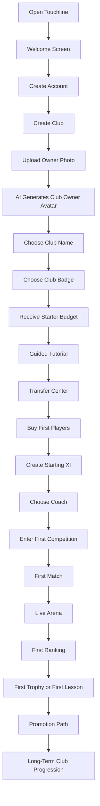
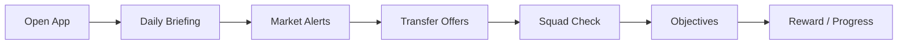
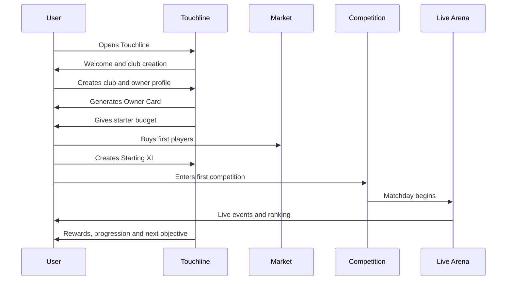

# Touchline User Experience Bible

Version: 0.1  
Author: Touchline Executive Documentation Board  
Last Updated: 2026-06-26  
Status: Draft Constitution  
Dependencies: 02_Product, 03_Fantasy, 04_Economy, 05_Transfer_Center, 10_Security  
Future Related Documents: Mobile Experience Bible, Live Arena UX, Transfer Center UX, Touchline Cards Visual System

## Executive Summary

Touchline must be understood within minutes and mastered over years.

The first-time user experience must be simple, emotional and guided. The long-term experience must feel deep, competitive and alive.

The user should never feel they are filling out a boring form.

The user should feel:

```text
I just entered my football headquarters.
```

Touchline's UX must combine:

- SaaS clarity.
- Football business credibility.
- AAA game emotion.
- Mobile-first speed.
- Long-term progression.

The onboarding promise:

```text
Create your club, build your squad, enter the market, compete, grow your legacy.
```

---

# Complete User Journey



---

# 01 First Time Experience

## Objective

Make the first minute feel premium, clear and exciting.

## User Feeling

The user should feel curiosity and status immediately.

## First Screen Goals

The welcome screen must explain:

- What Touchline is.
- What the user will become.
- What the first action is.
- Why this is different from normal fantasy football.

## Recommended Message

```text
Build your football empire.
Create your club, sign players, compete live and grow your legacy.
```

## Key UX Rule

Do not show too many options before the user understands the core loop.

## Risks

- Too much text.
- Too many buttons.
- Confusion between professional Touchline and Touchline Fantasy.
- User does not understand what to do first.

---

# 02 Onboarding

## Objective

Guide the user from zero to active club owner without confusion.

## Onboarding Steps

1. Account creation.
2. Choose experience: Fantasy Club Owner or Professional Platform.
3. Create club.
4. Upload photo.
5. Generate owner avatar.
6. Choose club badge.
7. Receive starter budget.
8. Learn first transfer.
9. Build first squad.
10. Enter first competition.

## UX Rule

Onboarding must feel like a club creation ceremony, not account setup.

## Progress Indicator

Use a premium progress bar:

```text
Step 1 of 7 — Create Your Club
```

## Risks

- Long onboarding can cause drop-off.
- Too much customization before gameplay delays excitement.
- Users may skip important rules.

## Improvement

Allow quick start and later customization.

---

# 03 Club Creation

## Objective

Give the user immediate ownership and identity.

## Required Steps

- Choose Club Name.
- Choose Country.
- Choose Club Badge.
- Choose Club Colors.
- Choose Stadium Style.
- Confirm Club Identity.

## Emotional Target

The user should feel:

```text
This is my club.
```

## UX Rule

Club creation must be fast but meaningful.

## Risks

- Users may choose offensive names.
- Badge generator may create poor visuals.
- Too much choice causes delay.

## Future Expansion

- AI badge generator.
- Stadium creator.
- Club anthem.
- Fanbase identity.
- Kit design.

---

# 04 Owner Profile

## Objective

Create a prestigious identity around the user.

## Flow

1. User uploads normal photo.
2. Touchline generates AI Club Owner Avatar.
3. User reviews avatar.
4. User confirms.
5. Owner Card is created.

## Owner Card Should Show

- Owner avatar.
- Club name.
- Club badge.
- Overall Rating.
- Global Ranking.
- Club Net Worth.
- Current League.
- Prestige Level.
- Titles.

## UX Rule

The owner profile should feel like a boardroom identity card.

## Risks

- Avatar generation disappointment.
- Privacy concerns.
- Identity misuse.

## Future Expansion

- Multiple avatar styles.
- Trophy portrait.
- Press conference portrait.
- Owner legacy page.

---

# 05 Transfer Center Experience

## Objective

Make the Transfer Center the daily heartbeat of Touchline.

## First Transfer Flow

1. User enters Transfer Center.
2. Touchline recommends affordable starter players.
3. User sees cards by category.
4. User selects player.
5. User reviews price and squad impact.
6. User confirms purchase or sends offer.
7. Player joins squad.

## Transfer Actions

- Buy.
- Sell.
- Loan.
- Exchange.
- Counteroffer.
- Add future clause.
- Add sell-on clause.

## UX Rule

Transfers must feel official and safe.

All negotiations stay inside Touchline Secure Negotiation Rooms.

## Risks

- User may not understand credits.
- Too many market options can overwhelm.
- Off-platform negotiation attempts.

## Future Expansion

- Deadline day mode.
- AI deal rating.
- Rival bids.
- Transfer rumors.
- Market movers.

---

# 06 Live Arena Experience

## Objective

Make matchday feel alive.

## Live Arena Should Show

- Live match score.
- User squad performance.
- Rival club performance.
- Player event cards.
- Goals.
- Assists.
- Cards.
- Injuries.
- Substitutions.
- Live ranking movement.

## Emotional Target

The user should feel tension.

Every event should matter.

## UX Rule

Live Arena must feel like a stadium command screen.

## Risks

- Too much animation can distract.
- Live data delays can frustrate.
- Mobile screen can become crowded.

## Future Expansion

- Crowd sound.
- Goal animation.
- Live card glow.
- Rival alert.
- Trophy race mode.

---

# 07 Competition Experience

## Objective

Give the user's club purpose.

## Competition Flow

1. Choose competition.
2. Review entry rules.
3. Register squad.
4. Confirm salary cap.
5. Enter match week.
6. Track Live Arena.
7. Receive results.
8. Gain ranking, rewards or lessons.

## Competition Types

- Domestic league.
- Cup.
- Champions-style tournament.
- Continental tournament.
- World tournament.
- Special event.

## UX Rule

Competition entry must clearly show:

- Requirements.
- Rewards.
- Risk.
- Deadline.
- Squad eligibility.

## Risks

- Complicated rules can confuse users.
- Losing too early can reduce retention.
- Unfair matching can damage trust.

## Future Expansion

- Promotion/relegation animation.
- Trophy ceremony.
- Rival history.
- Tournament bracket.

---

# 08 Daily Experience

## Objective

Give users a reason to return every day.

## Daily Loop



## Daily Elements

- Daily briefing.
- Transfer offers.
- Market movers.
- Player alerts.
- Club objectives.
- Squad health.
- Competition countdown.

## UX Rule

Daily experience must be useful in under 2 minutes.

## Risks

- Daily tasks become chores.
- Too many notifications.
- Rewards inflate economy.

---

# 09 Weekly Experience

## Objective

Create weekly rhythm and anticipation.

## Weekly Flow

- Review squad.
- Choose coach.
- Set formation.
- Confirm Starting XI.
- Check opponents.
- Enter competition round.
- Watch Live Arena.
- Collect weekly rewards.

## Emotional Target

The user should feel preparation, tension and consequence.

## UX Rule

Weekly planning should feel like match preparation.

## Future Expansion

- Weekly press conference.
- Coach advice.
- Rival scouting.
- Team morale report.

---

# 10 Seasonal Experience

## Objective

Make long-term progression meaningful.

## Season Flow

1. Season start.
2. Transfer window.
3. League rounds.
4. Cup competitions.
5. Mid-season review.
6. Deadline day.
7. Final rounds.
8. Trophy or promotion.
9. Season report.
10. New season preparation.

## Season Rewards

- Trophies.
- Promotions.
- Reputation.
- Credits.
- Prestige.
- Card cosmetics.
- Club history.

## UX Rule

The end of a season must feel like a major football moment.

## Future Expansion

- Season documentary.
- Club legacy timeline.
- Hall of Fame.
- Best XI of season.

---

# 11 Notifications

## Objective

Bring users back without annoying them.

## Notification Types

- Transfer offer received.
- Counteroffer received.
- Match starting soon.
- Goal scored by owned player.
- Player value changed.
- Competition deadline.
- Trophy won.
- Promotion achieved.
- Reputation changed.

## UX Rule

Notifications must be actionable.

Bad:

```text
Come back to Touchline.
```

Good:

```text
Sporting CP sent a counteroffer for your Gold striker.
```

## Risks

- Notification spam.
- Low-value alerts.
- Users disable notifications.

---

# 12 Mobile Experience

## Objective

Make Touchline feel premium and usable on mobile.

## Mobile Principles

- One primary action per screen.
- Clear bottom navigation.
- Large touch targets.
- Fast loading.
- Short text.
- No crowded tables.
- Cards over grids.
- Swipeable sections.

## Mobile Priority Screens

1. Daily Briefing.
2. Transfer Center.
3. Squad.
4. Live Arena.
5. Owner Card.
6. Notifications.

## Risks

- Desktop UI squeezed into mobile.
- Too much horizontal scrolling.
- Important buttons hidden.
- Live Arena overcrowding.

## Future Expansion

- Native mobile app.
- Push notifications.
- Lock screen match alerts.
- Mobile-first transfer negotiation.

---

# 13 Emotional Journey

## Objective

Design how the user feels over time.

## Emotional Stages

| Stage | Feeling |
| --- | --- |
| First open | Curiosity |
| Club creation | Ownership |
| Avatar generation | Identity |
| First transfer | Control |
| First match | Tension |
| First ranking | Competition |
| First trophy | Pride |
| First promotion | Ambition |
| Long-term play | Legacy |

## UX Rule

Every major milestone should be celebrated.

## Risks

- If early experience is confusing, emotion dies.
- If rewards are too small, progress feels flat.
- If losing feels punishing, users leave.

---

# 14 Retention Strategy

## Objective

Make Touchline habit-forming without feeling manipulative.

## Retention Loops

- Daily briefing.
- Transfer negotiations.
- Market movement.
- Weekly competition.
- Live match tension.
- Ranking changes.
- Trophy pursuit.
- Club Net Worth growth.
- Owner Card prestige.

## Long-Term Hooks

- Club legacy.
- Trophy cabinet.
- Promotion history.
- Rivalries.
- Owner reputation.
- Card collection.
- Seasonal records.

## UX Rule

Retention should come from meaningful football decisions, not empty rewards.

---

# 15 UX Risks

## Major Risks

| Risk | Impact | Prevention |
| --- | --- | --- |
| Too complex too early | New users leave | Guided onboarding and simple first actions |
| Too game-like | Professional users distrust it | Keep visual tone premium and serious |
| Too SaaS-like | Fantasy users get bored | Add emotion, animation and progression |
| Mobile crowding | Poor usability | Mobile-first layouts |
| Unclear economy | Users distrust credits | Simple explanations and transparent rules |
| Too many notifications | Users disable alerts | Actionable notification policy |
| Weak first session | Low retention | First transfer and first squad must happen fast |

---

# UX Flow



---

# Recommended Screen Order

1. Welcome Screen.
2. Account Creation.
3. Choose Experience.
4. Create Club.
5. Upload Owner Photo.
6. AI Owner Avatar.
7. Club Badge and Colors.
8. Starter Budget.
9. Tutorial Mission.
10. Transfer Center.
11. First Player Purchase.
12. Squad Builder.
13. Coach Selection.
14. Competition Entry.
15. Live Arena.
16. Results and Ranking.
17. Daily Briefing.
18. Long-Term Dashboard.

---

# Most Important Screens

## 1. Welcome Screen

Must explain Touchline instantly.

## 2. Club Creation

Creates ownership.

## 3. Club Owner Card

Creates status.

## 4. Transfer Center

Creates daily engagement.

## 5. Squad Builder

Creates control.

## 6. Live Arena

Creates emotion.

## 7. Competition Dashboard

Creates purpose.

## 8. Daily Briefing

Creates habit.

---

# Potential UX Problems

## Problem 1

User does not understand whether Touchline is professional platform or fantasy.

### Solution

Use clear mode selection:

- Touchline Professional.
- Touchline Fantasy.

## Problem 2

User feels overwhelmed.

### Solution

Unlock features gradually.

## Problem 3

User does not understand credits.

### Solution

Explain credits before first transfer.

## Problem 4

User loses first match and quits.

### Solution

Give learning feedback and next objective.

## Problem 5

Mobile screen feels crowded.

### Solution

Use cards, tabs and one main action per screen.

---

# Future Expansion

- Native mobile app.
- Club badge generator.
- Stadium builder.
- Press conference mode.
- Trophy ceremony.
- Owner rivalry system.
- Career documentary.
- AI assistant coach.
- Voice notifications.
- Live arena sound design.
- Augmented reality trophy room.

---

# Final UX Constitution

Touchline must obey five UX laws:

1. The user must understand the product within minutes.
2. The user must feel ownership in the first session.
3. The user must make a meaningful football decision quickly.
4. The user must see years of progression ahead.
5. Every screen must feel premium, useful and alive.

