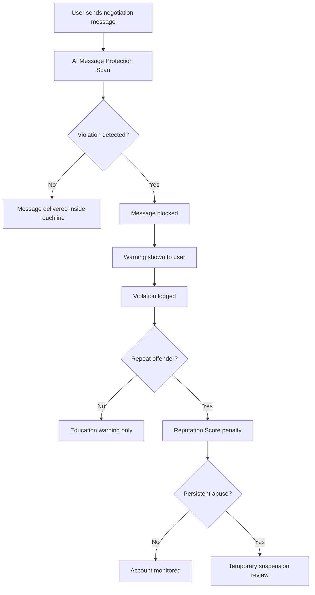

# Secure Transfer Policy

Version: 0.1  
Author: Touchline Executive Documentation Board  
Last Updated: 2026-06-26  
Status: Draft Constitution  
Dependencies: 04_Economy, 05_Transfer_Center, 10_Security, 12_Legal  
Future Related Documents: AI Message Protection System, Negotiation Room Security, Abuse Enforcement Policy

## Objective

All Touchline Card negotiations must happen exclusively inside the Touchline ecosystem.

This policy protects users, protects the economy, protects Touchline revenue, increases trust and prevents fraud.

## Constitutional Rule

No Touchline Card transaction may be negotiated, paid, completed or moved outside Touchline.

## Prohibited External Contact and Payment Data

The platform must block attempts to share:

1. Phone numbers.
2. Email addresses.
3. WhatsApp numbers.
4. Telegram handles or links.
5. Discord usernames, invite links or server links.
6. Instagram usernames or links.
7. Facebook links.
8. X/Twitter usernames or links.
9. PIX keys.
10. IBAN numbers.
11. PayPal information.
12. Crypto wallet addresses.
13. QR codes.
14. External payment requests.

## Prohibited Intent

Messages should also be blocked when the user attempts to:

- Move negotiations outside Touchline.
- Ask another user to pay externally.
- Share payment instructions.
- Request off-platform communication.
- Bypass Touchline fees.
- Hide deal terms outside the platform.
- Use code words to avoid detection.

## AI Message Protection System

Touchline must use an AI-assisted message protection system to detect attempts to move negotiations outside the ecosystem.

## Detection Categories

The system should detect:

- Contact information.
- Payment information.
- External communication channels.
- Off-platform negotiation intent.
- Suspicious coded language.
- QR code or image-based payment attempts.
- Repeated abuse patterns.

## Enforcement Flow



## User Warning

When blocked, the platform should show:

```text
For your safety, all Touchline Card negotiations must stay inside Touchline.
External contact details, external payment requests and off-platform negotiations are not allowed.
Repeated violations may reduce your Reputation Score or lead to temporary suspension.
```

## Reputation Penalties

Recommended enforcement levels:

| Level | Behavior | Action |
| --- | --- | --- |
| 1 | First low-risk attempt | Message blocked and warning shown. |
| 2 | Repeated attempts | Reputation Score reduction. |
| 3 | Clear external payment attempt | Strong warning and account flag. |
| 4 | Persistent abuse | Temporary suspension review. |
| 5 | Fraud or serious abuse | Account suspension and manual review. |

## Secure Negotiation Rooms

All negotiations must occur inside Touchline Secure Negotiation Rooms.

Every negotiation room must record:

- Original proposal.
- Counteroffers.
- Credits included.
- Cards included.
- Loan terms.
- Future clauses.
- Sell-on clauses.
- Buy-back clauses.
- Acceptance.
- Rejection.
- Expiration.
- User timestamps.
- System warnings.
- Moderation flags.

## Why This Matters

Secure negotiation protects:

- Users from scams.
- Touchline Credits from leakage.
- Marketplace trust.
- Transfer history integrity.
- Revenue model.
- Legal evidence.
- Dispute resolution.

## Product Rule

If a user wants to negotiate a Touchline Card, the product must guide them back into:

```text
Touchline Transfer Center → Secure Negotiation Room → Official Proposal
```

## Risks

- Users may try to bypass detection with spacing, emojis or coded words.
- False positives may block normal football conversation.
- Image-based QR codes require special detection.
- Over-enforcement may frustrate honest users.

## Improvements

- Add human review for high-value blocked deals.
- Add appeal flow for false positives.
- Train detection on multilingual football negotiation language.
- Detect images containing QR codes.
- Add safe templates for official proposals.

